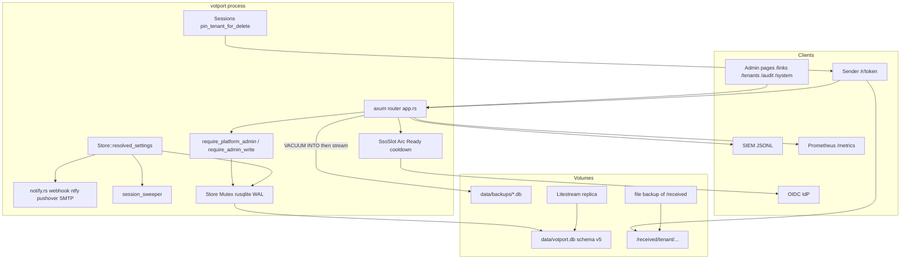
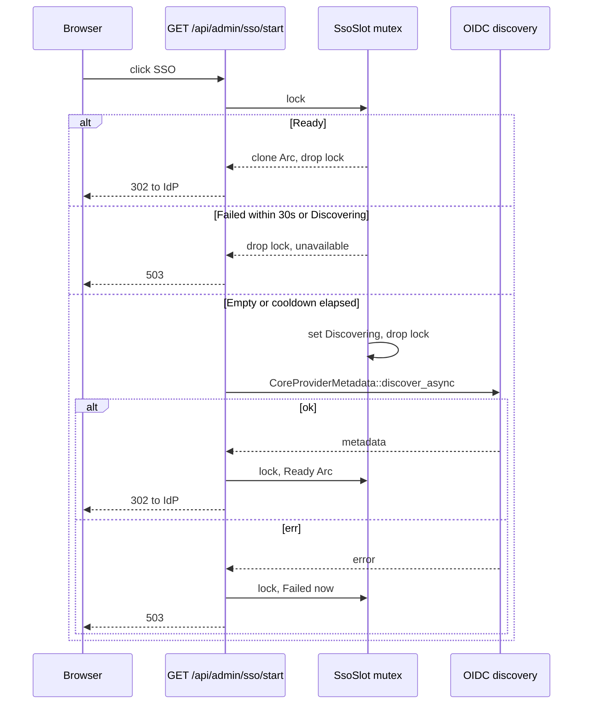

# votport enterprise operations (phases 6+)

| Field | Value |
| --- | --- |
| Status | Shipped on `ece4574` |
| Date | 2026-08-22 |
| Head | `ece4574` Move SMTP overlay tests into settings_tests |
| Continues | `docs/multi-tenancy.md` (phases 1-5 plus multi-page admin #28) |
| Audience | Senior engineers who already know the votport tree |

The body below preserves the design and pre-implementation baseline that
shipped. Later hardening added per-link legal hold in schema v6, the schema-v7
exact-byte files projection, atomic announced-byte/session reservations, and
reserved tenant storage. See [`multi-tenancy.md`](multi-tenancy.md) for current
behavior. The remaining follow-on is scoped automation tokens. VOT is pinned at
`0a129ea`. See the README roadmap for what that pin does and does not change.

## Overview

Phases 1-5 plus the multi-page admin shipped a single-instance, multi-tenant receive portal: SQLite WAL schema v3, queryable audit JSONL, OIDC with PKCE, tenant namespaces and quotas, `VACUUM INTO` backups, `/metrics`, retention sweeps, and pages at `/` `/links` `/tenants` `/audit` `/system`. A security team still cannot complete the product loop without SSH: notification channels and retention live only in env (`server/src/config.rs`), SMTP does not exist, SSO discovery caches `None` until process restart, tenant delete leaves `<receive>/<tenant>/` on disk, backup downloads the snapshot with `tokio::fs::read`, and there is no list of who can administer a tenant or how to kick them.

This design adds the smallest version that closes that loop. One instance sits behind the operator's IdP. Each group gets a namespace and a quota. Admins export JSONL to a SIEM, restore from a snapshot, and change notify/retention from System. Env remains the boot default and the break-glass when a settings row is absent. A PUT of JSON `null` deletes that row so env applies again. Commit `7ab2703` restored the original masthead/sheet UI and removed a dead settings form that had no backend; this design does not put a form back until the store and `GET/PUT /api/admin/settings` exist.

## Background & Motivation

### Current state

| Piece | Where it lives |
| --- | --- |
| Schema v3 | `server/src/store.rs`: `meta`, `links` (+ `tenant`), uploads/events as embedded JSON, `tenants`, `audit_log`. `SCHEMA_VERSION` is the string `"3"`. `Store::open` sets `journal_mode=WAL` and `synchronous=FULL` only. No `foreign_keys` pragma and no `REFERENCES` in `SCHEMA`. |
| Audit export | `GET /api/admin/audit?limit=&since=&after_rowid=` in `admin_audit_export`. Named tenants see only their rows; default-tenant admin sees all. |
| SSO | `server/src/api/sso.rs`. `App.sso_client` is `OnceCell<Option<SsoClient>>` filled by `app::discover_sso`. Groups map to admin/viewer plus named-tenant grants. |
| Local password | `AdminIdentity::local_admin` (`subject: "local"`, default tenant only). `admin_change_password` persists into `meta.admin_password_hash`. |
| Tenants | `POST/GET /api/admin/tenants`, `DELETE /api/admin/tenants/{key}`. `list_tenants` today: `require_admin` plus `identity.tenant.is_empty()` (a default-tenant **viewer** can GET). `create_tenant` / `delete_tenant`: also `require_admin_write`. `backup_database` / `admin_change_password`: default-tenant **and** `role == "admin"`. |
| Quotas | Enforced in `upload::create_session` and `admin::create_link`. Fail-closed when a named link's tenant row is gone. `create_session` calls `session::spawn_worker` **then** `sessions.insert` (`upload.rs`); the worker can `create_dir_all` before the handle is in the map. `insert_link` is a bare `INSERT` with no tenant-row check and no FK. `create_tenant` uses `filter(|&bytes| bytes > 0)`, so 0 means unlimited. |
| Notify | `server/src/notify.rs`: webhook, ntfy, Pushover from `app.config`. Fire-and-forget. `upload.rs` already `tokio::spawn`s `notify::uploaded`; `app::upload_ended_notifier` sends `upload_failed` (outcome `rejected`, or `interrupted` after bytes arrived; never `cancelled` or an interrupted session that received nothing) for links with notify on upload set. |
| Backup | `admin::backup_database`: `spawn_blocking` + `Store::backup_into` (`VACUUM INTO`), then `tokio::fs::read` of the whole file. |
| Sweeper | `app::session_sweeper`: idle sessions every 60s; daily audit prune, backup-file prune (30 days), upload-retention delete. Reads `app.config.*_retention_days`. |
| Admin pages | `/` sign-in, `/links`, `/tenants`, `/audit`, `/system`. System today: password form, backup `<a href>`, receipt key. |

### Pain points (verified in code)

1. **Tenant delete does not match the threat table.** `delete_tenant` in `server/src/api/admin.rs` refuses while `tenant_link_count > 0` or `sessions.active_for_tenant > 0`, then `Store::remove_tenant` drops the row. It does not delete `<receive_dir>/<tenant>/`. The tenants UI copy currently says received files on disk stay. `docs/multi-tenancy.md` promised subtree purge plus an audit tombstone. The in-flight check is TOCTOU: `create_session` spawns the worker before `sessions.insert`, so `create_dir_all` can run while `active_for_tenant` is still 0. Fail-closed in `create_session` runs only after the tenant row is already gone.

2. **Break-glass is one platform password, not per tenant.** `AdminIdentity::local_admin` grants only `tenant: ""`. `switch_tenant` honors only grants already in the cookie, so the local admin cannot enter `acme` during an IdP outage. The threat table's "break-glass account per tenant" is unimplemented.

3. **SSO discovery is sticky-fail.** `app::discover_sso` logs an error and returns `None`. `OnceCell::get_or_init` caches that forever. The 503 string in `sso::start_flow` says "SSO discovery failed at startup" but discovery runs on first use. `SsoClient` is not `Clone` (it owns `CoreClient` plus `reqwest::Client`).

4. **azp/hd are unvalidated.** Comment at the top of `sso.rs`: fine for a single `client_id`. The `openidconnect` crate checks issuer, audience, and nonce.

5. **Quota TOCTOU** is already documented in `docs/multi-tenancy.md` phase 4. Concurrent sessions can overshoot `max_total_bytes` by up to `(max_sessions - 1) * cap`. This design does not close it.

6. **Backup body is an in-memory copy.** VACUUM is already off the async thread. `/metrics` still walks the store `Mutex` on the async thread (one `links()` per tenant). Tokio `Cargo.toml` does not declare `fs` or `io-util` even though `app.rs` already calls `tokio::fs` (transitive today).

7. **Config is env-only.** No settings table. No SMTP. `7ab2703` removed the dead settings form; System has no notify/retention editors.

8. **README still says "one-page admin UI".**

### Product goal restated

A security team can put one instance behind their IdP, give each group a namespace and a quota, export JSONL to a SIEM, restore from a snapshot, and change notify/retention without SSH.

## Goals & Non-Goals

### Goals

1. DB-backed settings that override env for notification channels, retention days, and default quotas, editable from System by the default-tenant admin, with an explicit revert-to-env.
2. SMTP upload-complete notices with the same fire-and-forget shape as ntfy.
3. SSO discovery that retries after a cooldown, plus azp validation when the claim is present.
4. A principals list on `/tenants` with session revoke (and a block flag so revoke is not a no-op against a still-grouped SSO user).
5. Tenant offboarding that purges the receive subtree, stays fail-closed during the purge, is retryable if leftovers remain, and audits a tombstone.
6. Streaming backup download of a completed `VACUUM INTO` snapshot (with `Content-Length`) and a documented RPO/RTO that names Litestream for the database and the existing file backup for `/received`.

### Non-goals

- Postgres, a `Store` trait, or a second backend. Introduce a trait only when a second backend exists (`docs/multi-tenancy.md`).
- Horizontal replicas. One writer (SQLite) remains the scale story.
- SAML. OIDC plus a bridge is the enterprise answer already recorded.
- Per-tenant encryption keys, custom domains, tenant self-signup, public sharing.
- Closing the quota TOCTOU.
- Dashboard rewrite, component library, Kubernetes.
- Invites or SCIM.
- Automation tokens exist (`POST /api/automation/share`, per-tenant, expiring, revocable, rate limited per IP, optionally confined to a library folder, use and token refusal audited).
- Legal hold versus retention (per-tenant or per-link "do not sweep" flag). Own design later.

### Engineering constraints

- Each PR independently reviewable and mergeable. Schema-version PRs are ordered: PR 5 must not merge before PR 1.
- Gates: rustup 1.97.1, `cargo fmt --check`, `cargo clippy --all-targets -- -D warnings`, `cargo test` (40 unit + 12 e2e today), `node --check` + eslint 9.18.0 on `web/assets/*.js`, `node --test scripts/login-disclosure.test.mjs`, cargo-deny advisories, docker build.
- Tests land with the change. Guards get the test that kills them.
- Web: CSP has no inline scripts (`app.rs` `CSP`); JS stays in `/assets`. All ids/classes are load-bearing (`web/assets/style.css` header).
- umask 022 (pinned in `app::build`) plus `paths::tighten_dir` on any new directory-creation path. VOT refuses group-writable staging parents.
- Tenant lifecycle stays default-tenant admin only. Extract the gate already used by `backup_database` (`require_admin` + `identity.tenant.is_empty()` + `identity.role == "admin"`) as one helper, e.g. `require_platform_admin`. Reuse `require_admin_write` for mutations. Do not invent a parallel authz system.
- No new frameworks. Prefer fewest new crates.

## Key Decisions

1. **Settings live in a dedicated `settings` KV table (schema v4), not in `meta`.** `meta` already holds `schema_version` and `admin_password_hash`. Mixing notify tokens with the break-glass hash makes redaction and audits messier. KV (not a single JSON blob) lets SMTP land later as new keys without a schema bump.

2. **Env is the boot default. A written settings key wins. Empty string disables a URL/token. JSON `null` deletes the row (revert to env).** That is how an admin turns off a compose-file webhook without SSH (write `""`) and how they undo a mistaken PUT (write `null`). Unwritten keys keep env. Restart does not clear DB rows.

3. **Do not mutate `App.config`.** `Config` stays the env snapshot (`#[derive(Clone)]` in `config.rs`). `Store::resolved_settings(&Config) -> ResolvedSettings` is the overlay. `notify::uploaded` and `app::session_sweeper` call it. No in-memory cache, so a PUT is visible on the next complete upload or daily tick. Invalid stored TEXT skips to env and logs `tracing::error`; resolve never panics.

4. **No settings form until GET/PUT exist.** Matches `7ab2703`. API PR first; System editors after SSO retry so `sso_healthy` exists.

5. **SMTP uses `lettre` 0.11 with `default-features = false` and features `builder`, `smtp-transport`, `tokio1-rustls-tls`, `hostname`.** No `native-tls`, `sendmail-transport`, or `dkim`. An in-tree AUTH PLAIN + STARTTLS client is more code than the crate, and `reqwest` already pulls rustls. Sendmail is not in the container. Tests speak to a loopback SMTP stub without TLS. Do not add `lettre` in PR 1. `ResolvedSettings.smtp` is `Some` iff host, from, and at least one `to` all resolve non-empty.

6. **Replace `OnceCell<Option<SsoClient>>` with `SsoSlot` holding `Ready(Arc<SsoClient>)`.** Clone the `Arc` and drop the mutex before any await. Claim the attempt (`Discovering`) so two callers do not both hit the IdP. Cooldown 30s on `Failed`. `sso_available` uses `try_lock` and reports `sso_healthy` only for `Ready`. Success is process-sticky (metadata rotation still needs a restart unless a Ready TTL is added later). The 503 string must stop claiming "at startup".

7. **Validate `azp` when the claim is present; do not add `hd` until a second client or a hosted-domain env exists.** Single-`client_id` remains the documented deploy. `azp == client_id` is cheap and correct even then.

8. **Never fully hide break-glass on the login page. Never disable `POST /api/admin/login`.** Default: password form is visible. Optional System toggle collapses it behind a disclosure that stays in the DOM (`<details>` or equivalent; password input ids unchanged). `Ready` is process-sticky, so `sso_healthy` must not be the condition that removes the form: an IdP outage after a successful discovery would lock browser-only operators out for up to `ADMIN_SESSION_SECS` (7 days). Without SSO configured, the form stays expanded even if `VOTPORT_PUBLIC_PASSWORD_LOGIN=0`. The login API always accepts the platform password (throttled as today).

9. **One platform break-glass, with live grants to every named tenant.** Revise the threat table rather than invent per-tenant passwords. `require_admin` expands `subject == "local"` grants from `store.tenants()` on every request so a newly created namespace is reachable without re-login.

10. **Principals are SSO-sourced. Revoke = bump `credential_version` plus a `blocked` flag.** IdP group membership remains the source of truth for "who should have access". Session-only revoke is a lie if they can click SSO again; `blocked` makes the smallest slice honest. No invites, no SCIM. Revoke/unblock POST a JSON `{ "subject": "..." }` body, not a path segment.

11. **Bind per-subject version as JSON `"cv"` on `AdminIdentity` with `#[serde(rename = "cv", default = "cv_one")]`.** Build the cookie payload with `serde_json::to_string` of `AdminIdentity` so issue and verify share one field set. After principal upsert, set `identity.credential_version` from the row (1 if no row). `switch_tenant` copies `credential_version`. `local_admin()` sets `cv: 1` in the struct literal. Global `admin_token_phc` stays in the MAC so a local password change still evicts everyone, including SSO. Missing principal row accepts `cv == 1` only. Present row requires `cv == credential_version && blocked == 0`. Pre-v5 cookies (no field) deserialize as `cv: 1`.

12. **Tenant delete pins on the `Sessions` mutex (the same lock as `insert`), drops the tenant row so fail-closed applies, then purges `<receive>/<tenant>/` via `paths::join_under`.** `Sessions::insert` fails if that tenant is pinned. Register the session under that lock **before** the worker can touch disk (create the channel, insert, then spawn with the receiver). If insert fails, do not spawn. `insert_link` for a named tenant fails in the same `Store::with` if the `tenants` row is gone. Default tenant (`""`) is not deletable. `DELETE` leftover retry is only when `remove_tenant` is `Absent` **and** the directory exists **and** no default-tenant link has `dest == key` or `dest` prefixed by `key/`. Unknown key with no directory is 404. Only `Deleted` in the same request is unconditional purge. If `join_under` fails after `remove_tenant`, unpin and 500 so leftover DELETE still works. Concurrent `HasLinks` aborts before purge: unpin, 409, files intact.

13. **Stream the completed `VACUUM INTO` snapshot with `tokio_util::io::ReaderStream`; do not `tokio::fs::read` it; set `Content-Length` from metadata.** VACUUM stays in `spawn_blocking`. Do not stream a live `VACUUM INTO`. Declare tokio `fs` + `io-util` and a direct `tokio-util`/`io` dep. Litestream is the documented RPO for the database, not a Postgres migration. `/received` stays on the existing file backup. Restore remains stop-replace-start.

14. **Quota TOCTOU stays.** Cheap fixes that take a store write lock across the whole upload are worse than the documented bound.

15. **Follow-ons, not this stack:** scoped automation tokens; legal hold versus retention.

16. **Platform reads use the backup gate.** `require_admin` + empty tenant + `role == "admin"`. Apply to GET settings, tighten `list_tenants` (today a default-tenant viewer can GET it), and GET tenants once it carries principals. Viewer 403 tests land with the change.

17. **`PATCH /api/admin/tenants/{key}` lands in PR 1 next to `default_max_*` / `create_tenant`, not in the principals PR.** Quota-after-create is an API hole, not user-management. No tenants-page rewrite in that PR; document the curl in `docs/deployment.md`.

## Proposed Design

### Architecture (after this stack)



### Authz gates (do not fight these)

Extract the check `backup_database` already performs:

```text
fn require_platform_admin(app, headers) -> ApiResult<AdminIdentity> {
    let identity = require_admin(app, headers)?;          // cookie MAC + global credential tag
    if !identity.tenant.is_empty() || identity.role != "admin" {
        return Err(403 "default-tenant admin required");
    }
    identity
}
```

Mutations add `require_admin_write(headers, &identity)?` (`role == "admin"` AND `X-Votport`). `require_platform_admin` already requires `role == "admin"`, so write routes still need the CSRF header check.

Apply `require_platform_admin` to:

- GET `/api/admin/settings` (read)
- PUT `/api/admin/settings` (plus write; missing `X-Votport` is 403, test in PR 1)
- GET `/api/admin/tenants` (tightens today's viewer-can-list behavior)
- PATCH `/api/admin/tenants/{key}` (plus write)
- POST `/api/admin/tenants` and DELETE (already write + empty tenant; switch the empty-tenant check to the helper)
- POST `/api/admin/principals/revoke` and `/unblock` (plus write)
- GET `/api/admin/backup` (this gate plus the `X-Votport` header, since it writes a snapshot file and an audit row)

`admin_session` already exposes `pages: ["links","audit"]` plus `tenants` and `system` only when `identity.tenant.is_empty() && identity.role == "admin"`. Settings and principals stay on those pages. Named-tenant admins never see System. Default-tenant viewers never see `/tenants` or `/system` and, after PR 1, cannot GET those APIs either.

### Schema versions

Today `Store::open` runs `CREATE TABLE IF NOT EXISTS` for v3, then stamps `schema_version = '3'` unconditionally (`INSERT ... ON CONFLICT DO UPDATE`). A binary that understood only v3, started against a v4 file, would rewrite the version down without dropping tables. That is a latent footgun.

From the settings PR (PR 1):

1. Read `meta.schema_version` (missing counts as 3 after the existing `ALTER TABLE links ADD COLUMN tenant`).
2. If current > `SCHEMA_VERSION`, refuse startup with a clear error.
3. If current < 4, `CREATE TABLE settings (...)`.
4. Stamp `SCHEMA_VERSION` only after migrations succeed, and never to a lower number.

PR 5 (principals) **hard-depends on PR 1**. It adds: if current < 5, `CREATE TABLE principals (...)`, then stamp `"5"`. It must not ship the never-downgrade guard without the v4 `settings` table: a greenfield jump 3 to 5 with no `settings` table would make a later `SCHEMA_VERSION=4` binary refuse to boot.

`SCHEMA_VERSION` becomes `"4"` in PR 1 and `"5"` in PR 5.

```sql
CREATE TABLE IF NOT EXISTS settings (
    key TEXT PRIMARY KEY,
    value TEXT NOT NULL,
    updated_at INTEGER NOT NULL,
    updated_by TEXT NOT NULL DEFAULT ''
);

CREATE TABLE IF NOT EXISTS principals (
    subject TEXT PRIMARY KEY,
    credential_version INTEGER NOT NULL DEFAULT 1,
    blocked INTEGER NOT NULL DEFAULT 0,
    last_login_at INTEGER NOT NULL DEFAULT 0,
    last_groups TEXT NOT NULL DEFAULT '[]',
    last_grants TEXT NOT NULL DEFAULT '[]',
    source TEXT NOT NULL DEFAULT 'sso'
);
```

No `REFERENCES` clauses. Do not enable a `foreign_keys` pragma in this stack.

Do not store SMTP/ntfy secrets in `audit_log.detail`. Settings PUTs audit the keys changed (and which were reset), not the values.

### 1. DB-backed settings

#### Overlay

```rust
// New type in store.rs (shape, not a freeze of field order).
pub struct ResolvedSettings {
    pub notify_webhook: Option<String>,
    pub notify_ntfy: Option<String>,
    pub notify_ntfy_token: Option<String>,
    pub notify_pushover: Option<(String, String)>,
    pub smtp: Option<ResolvedSmtp>, // always None until the SMTP PR
    pub audit_retention_days: u64,
    pub upload_retention_days: u64,
    pub default_max_total_bytes: Option<u64>,
    pub default_max_links: Option<u64>,
    pub default_max_sessions: Option<u64>,
    pub public_password_login: bool,
}
```

Resolution per key:

| DB row | Result |
| --- | --- |
| Absent | env (`Config`), including `None` / default numbers |
| Present, non-empty | DB value (parsed per codec below) |
| Present, empty string | disable for URL/token keys only (`None`). Must not appear for numbers/bools (PUT rejects). |
| Invalid TEXT (non-u64 days, garbage) | skip to env, `tracing::error!`, never panic |

Pushover stays all-or-nothing: token and user must both resolve to Some, else the channel is off (same as `from_env` today).

`Store::setting(key)`, `Store::put_settings(actor, &[(key, SettingWrite)])`, `Store::delete_setting(key)`, `Store::resolved_settings(&Config)`.

```rust
enum SettingWrite {
    Set(String), // including empty string for URL/token disable
    Reset,       // DELETE the row
}
```

#### PUT codec (frozen)

PUT body is a JSON object of known keys. Unknown keys: `422`. Omitted key: leave DB (or env if never written).

| Keys | JSON type on PUT | `null` | `""` | Other |
| --- | --- | --- | --- | --- |
| `notify_webhook`, `notify_ntfy` | string | DELETE row (env) | store empty (disable) | must be `http://` or `https://`; else 422 |
| `notify_ntfy_token`, `notify_pushover_token`, `notify_pushover_user`, later `smtp_password` | string | DELETE row | store empty (disable) | any non-empty string; not returned on GET |
| `audit_retention_days`, `upload_retention_days` | number (u64, including 0 = off) | DELETE row | 422 | reject negative, float, string |
| `default_max_total_bytes`, `default_max_links`, `default_max_sessions` | number (u64 **> 0**) | DELETE row (unlimited / env) | 422 | reject `0` (never store `"0"` as a zero-byte cap; matches `create_tenant`'s `filter(|&bytes| bytes > 0)`) |
| `public_password_login` | bool | DELETE row | 422 | store `"1"` / `"0"` |
| SMTP keys (SMTP PR) | host/from/to/username: string; `smtp_port`: u64; `smtp_starttls`: bool; `smtp_password`: secret string | DELETE row | disable string fields | port 1..=65535; `to` comma-separated |

Storage is always TEXT. Numbers as decimal strings. Bools as `"1"` / `"0"`.

#### GET shape

```json
{
  "notify_webhook": "https://hooks.example/vot",
  "notify_webhook_source": "env",
  "notify_ntfy": null,
  "notify_ntfy_source": "env",
  "notify_ntfy_token_set": false,
  "notify_ntfy_token_source": "env",
  "notify_pushover_set": false,
  "audit_retention_days": 400,
  "audit_retention_days_source": "env",
  "upload_retention_days": 0,
  "upload_retention_days_source": "env",
  "default_max_total_bytes": null,
  "default_max_total_bytes_source": "env",
  "default_max_links": null,
  "default_max_sessions": null,
  "public_password_login": true,
  "public_password_login_source": "env",
  "sso_configured": true
}
```

Secrets never leave the process: GET returns `*_set: bool` and `*_source`, not the token. `sso_healthy` lives on `GET /api/admin/sso`, not on settings (login page already calls SSO). System can GET both.

`*_source` is `"env"` when the row is absent (or invalid-skipped), `"db"` when a row exists, including a stored empty disable.

Audit: `settings_updated` with `actor = identity.subject`, `detail = { "keys": ["notify_webhook"], "reset": ["audit_retention_days"] }`.

#### Call sites that must switch from `app.config`

- `notify::uploaded`: read `resolved_settings` once per completion. Already runs on a `tokio::spawn` from `upload.rs`; keep it that way.
- `app::session_sweeper` daily tick: retention days from resolved settings, not `app.config.audit_retention_days` / `upload_retention_days`.
- `create_tenant`: if the request omits a quota field, fill from `default_max_*`.
- `create_session` / `create_link`: if `store.tenant(&link.tenant)` is `None` because the tenant is the implicit default (`""`), apply `default_max_*` as that namespace's caps. Named tenants keep their row. Homelab users who never set defaults keep unlimited, same as today.

`effective_cap` in `upload.rs` (per-link vs `config.max_upload_bytes`) is unchanged. `max_upload_bytes` stays env.

#### PATCH tenant (PR 1, not principals)

`PATCH /api/admin/tenants/{key}`: `require_platform_admin` plus `require_admin_write`. Body may include `label`, `admin_group`, `max_total_bytes`, `max_links`, `max_sessions`. Does not rename `key` (it is a folder name). Quota fields: omit = leave; JSON `null` = clear (unlimited); number `> 0` = set; `0` = 422. Audit `tenant_updated`. Document curl next to the existing create example in `docs/deployment.md`. No tenants-page redesign in this PR.

#### System page editors (after settings API and SSO retry)

`web/system.html` plus `web/assets/page-system.js`. New cards using existing `form.card` / `.grid` / `label` / `.muted` / `.error` patterns from the password form. No new CSS vocabulary unless a class already exists.

Cards:

1. Notifications: webhook URL, ntfy URL, ntfy token (placeholder "unchanged" when `token_set`), Pushover token/user. Each field: a "Use environment" control that PUTs JSON `null` for that key. Empty input on save PUTs `""` (disable).
2. Retention: audit days, upload days. `0` labeled as off. Same "Use environment" control.
3. Default quotas: bytes (GiB input like `tenants.html`), max links, max sessions. Empty + save without touching "use environment" is not `0`; leave omitted or PUT `null` only from the explicit control. Never PUT `0`.
4. Sign-in: checkbox "Collapse the local password form when SSO is offered". Helper text: the password form stays in the page behind a disclosure; `POST /api/admin/login` always works; without SSO the form stays expanded. Disabled (checkbox ignored) when `sso_configured` is false.

Do not add a settings form in the API-only PR. Do not add SMTP fields until the SMTP PR.

`web/index.html` / `web/assets/login.js`: wrap `#login-form` in `<details id="login-password-details">` with `<summary>Use local password</summary>` (or keep the form where it is and add the details wrapper around it). **The password form and its input ids stay in the DOM always.** Behavior:

- SSO not configured (`available == false`): details open (or omit the collapse). Form as today. `#login-sso` hidden.
- SSO configured and `public_password_login == true`: details open, SSO button visible.
- SSO configured and `public_password_login == false`: details **closed**, SSO button visible. Operator can expand the disclosure without a second request.
- `sso_healthy == false`: do not close or remove the form; may show muted text on the SSO button ("SSO is not reachable"). Health is process-local and not persisted.

`GET /api/admin/sso` (public): `{ "available": bool, "sso_healthy": bool, "public_password_login": bool }`. `sso_healthy` is added in the SSO-retry PR via `try_lock`. `public_password_login` is added in the System/login PR from the overlay (default true if the settings row is absent).

#### Tests (API PR)

- GET with empty table returns env defaults (`testing::build` has retention 400 / 0) and `*_source: "env"`.
- PUT then GET shows `source: "db"` and the new values.
- PUT omitting a secret leaves the previous DB value.
- PUT `""` on a URL disables it even when env has a value (the test builds `App` with `notify_webhook: Some(...)`).
- PUT `null` on that key deletes the row; GET follows env again (`source: "env"`).
- PUT `0` on `default_max_total_bytes` is 422; PUT `0` on `audit_retention_days` is 200 (off).
- PUT a non-http URL is 422.
- Invalid TEXT in the table (hand-inserted `"nope"` for days) resolves to env and does not panic.
- Default-tenant **viewer** cookie is 403 on GET settings and GET tenants (tighten `list_tenants`). Named-tenant admin is 403. Missing `X-Votport` on PUT is 403.
- `notify::uploaded` hits the DB webhook, not the env one, after PUT (loopback listener).
- Sweeper path: `resolved_settings` returns the DB retention; a unit test on the overlay is enough (do not sleep a day).
- Opening a v4 database with a forged `schema_version = 99` refuses.
- Stamping never writes a lower version.
- PATCH tenant quota then `create_session` hits the new cap.

Grep `Config {` in the settings PR (construction sites include `from_env`, `api::testing::build`, `admin.rs` `testing_config_public`, `tests/e2e.rs` `start_server_with_cap`, and `testing_config_snapshot` which currently clones the public helper). Do not maintain a frozen list of four. SMTP fields stay off `Config` until the SMTP PR.

### 2. SMTP notifications

Same shape as ntfy in `notify.rs`: best-effort, fire-and-forget, `tracing::warn` on failure, never fails the upload. `notify::uploaded` is already `tokio::spawn`ed from `upload.rs`; the 15s SMTP await stays inside that task. `log_smtp_failure` must not panic.

```rust
// notify.rs, after the pushover block
if let Some(smtp) = settings.smtp {
    log_smtp_failure(send_smtp(&smtp, &title, &body).await);
}
```

`ResolvedSettings.smtp` is `Some` iff **host, from, and at least one `to` (after split/trim) all resolve non-empty**. Username and password are optional. Port default 587. `smtp_starttls` default true.

TLS mode:

- port 465: implicit TLS (regardless of the starttls flag).
- any other port and `starttls == true`: STARTTLS.
- any other port and `starttls == false`: plaintext (unit tests against a loopback stub).

Crate, SMTP PR only:

```toml
lettre = { version = "0.11", default-features = false, features = ["builder", "smtp-transport", "tokio1-rustls-tls", "hostname"] }
```

Do not enable `native-tls`, `sendmail-transport`, or `dkim` (`dkim` would pull `rsa`; `deny.toml` already ignores RUSTSEC-2023-0071 as verify-only). Timeout 15s to match `App.http`.

Env boot defaults (optional): `VOTPORT_NOTIFY_SMTP_HOST`, `VOTPORT_NOTIFY_SMTP_PORT`, `VOTPORT_NOTIFY_SMTP_USERNAME`, `VOTPORT_NOTIFY_SMTP_PASSWORD`, `VOTPORT_NOTIFY_SMTP_FROM`, `VOTPORT_NOTIFY_SMTP_TO`, `VOTPORT_NOTIFY_SMTP_STARTTLS`. Overlay is per-key; assembly uses the same required set as above (host/from/to). A host in DB with from/to still in env is `Some` if all three resolve. Empty `smtp_password` is optional, not a reason to disable the channel.

System card fields land in the SMTP PR (the settings form already exists). GET redacts `smtp_password`.

Tests: tokio listener that answers `220` / `250` / `354` / `250`; send with starttls false to that port (not 465); assert `MAIL FROM` and body contain the label. A second test: missing host means `smtp` is `None` (no panic). A third: host+from without `to` is `None`.

### 3. SSO that survives a blip

Replace:

```rust
pub sso_client: tokio::sync::OnceCell<Option<crate::api::sso::SsoClient>>,
```

with:

```rust
pub struct SsoSlot {
    inner: tokio::sync::Mutex<SsoSlotState>,
}

enum SsoSlotState {
    Empty,
    Discovering,
    Ready(std::sync::Arc<SsoClient>),
    Failed { at: std::time::Instant },
}

impl SsoSlot {
    /// Clones the Arc and drops the mutex before any await.
    pub async fn get_or_discover(
        &self,
        config: &crate::config::OidcConfig,
        public_url: &str,
    ) -> Result<std::sync::Arc<SsoClient>, ()> { /* below */ }

    /// Non-blocking. Healthy only for Ready. Busy lock => false.
    pub fn health_peek(&self) -> bool {
        self.inner
            .try_lock()
            .map(|g| matches!(*g, SsoSlotState::Ready(_)))
            .unwrap_or(false)
    }
}
```

`get_or_discover` lock policy:

1. Lock.
2. `Ready(arc)`: clone `Arc`, drop guard, return `Ok(arc)`.
3. `Failed { at }` if `at.elapsed() < 30s`: drop guard, return `Err(())` (no network).
4. `Discovering`: drop guard, return `Err(())` (do not stack a second discover).
5. `Empty` or `Failed` with cooldown elapsed: set `Discovering`, drop guard, `SsoClient::discover(...).await`.
6. Re-lock. On success store `Ready(Arc::new(client))` and return a clone. On error store `Failed { at: Instant::now() }` and return `Err(())`. If another task already wrote `Ready` while we were awaiting, keep that `Ready` and return it (do not overwrite success with a late failure).

Success is process-sticky: `Ready` is never cleared for metadata rotation. Document in `docs/deployment.md`: rotating IdP metadata still needs a process restart unless a Ready TTL is added later.

`start_flow` and `sso_callback` both call `get_or_discover` and hold only the `Arc` across token exchange / userinfo. 503 text: "SSO discovery failed; try again shortly". Log the real error at `tracing::error` as today.

`sso_available` stays unauthenticated and must not discover. `available: sso_config.is_some()`, `sso_healthy: slot.health_peek()`.



#### azp / hd

After `id_token.claims(...)` succeeds, if the claims carry an authorized party and it is not equal to `OidcConfig.client_id`, fail the sign-in with the existing `home("identity could not be verified")` path and audit `sso_failed`.

Do not add `hd` (Google hosted domain) in this stack. Document in `docs/deployment.md`: a single `VOTPORT_OIDC_CLIENT_ID` is the supported shape; the crate's audience check plus this azp check cover it. A second client id or an `hd` allow-list is a later change.

Unit tests: extract a `fn azp_ok(azp: Option<&str>, client_id: &str) -> bool` and table-test present/mismatch/absent. Cooldown: a fake discover counter (inject via `#[cfg(test)]` function pointer or a thin wrapper around `discover`) asserts a second call inside 30s does not increment, and that two concurrent Empty callers result in one discover (Discovering). `health_peek` is false on Empty/Failed/Discovering and true on Ready.

### 4. User management (smallest shippable slice)

Today:

- Who can administer a tenant: members of `Tenant.admin_group` (SSO `groups` claim) plus, for the default tenant, members of `VOTPORT_OIDC_ADMIN_GROUP` (or everyone, if that env is unset). Computed in `sso_callback` into `AdminIdentity.grants`.
- How they got that role: IdP group membership at last login. Nothing is persisted except `audit_log` rows (`sso_login`).
- How you revoke: remove the group at the IdP (takes effect at next login). There is no in-app kick. Changing the local password evicts *every* session because `admin_token_phc` is the global MAC version.

Threat table line "Local break-glass account per tenant, created at first boot" is **unimplemented**. This design revises it (Key Decision 9) rather than adding per-tenant passwords.

#### Principals table (schema v5)

Upsert on successful SSO login in `sso_callback` (do not insert `"local"`):

```text
INSERT ... ON CONFLICT(subject) DO UPDATE
  last_login_at, last_groups, last_grants
  -- do not reset credential_version or blocked
RETURNING credential_version, blocked
```

If `blocked != 0`, refuse before issuing a cookie (testable helper, no live IdP). Then:

```text
identity.credential_version = row.credential_version  // 1 on first insert
```

Local sign-in stays `AdminIdentity::local_admin`, which sets `credential_version: 1` in the struct literal (serde default does not fill literals).

#### Token binding

Today `identity_payload` is a `serde_json::json!` map of `subject/tenant/role/grants` (`auth.rs`), not `to_string` of the struct. Freeze one JSON name and one encode path:

```rust
#[derive(Clone, Debug, Serialize, Deserialize)]
pub struct AdminIdentity {
    pub subject: String,
    pub tenant: String,
    pub role: String,
    #[serde(default)]
    pub grants: Vec<TenantGrant>,
    #[serde(rename = "cv", default = "cv_one")]
    pub credential_version: u64,
}
fn cv_one() -> u64 { 1 }

fn identity_payload(id: &AdminIdentity) -> String {
    serde_json::to_string(id).expect("AdminIdentity is serde-json")
}
```

MAC context stays `votport-admin-v3`. `verify_admin_token` already `from_str`s the payload into `AdminIdentity`; pre-v5 cookies lack `cv` and deserialize as 1.

`require_admin` after `verify_admin_token`:

1. MAC still covers global `admin_token_phc` (password rotation still nukes SSO sessions).
2. If `subject != "local"`, `Store::principal(subject)`:
   - missing row: accept only if `identity.credential_version == 1`
   - present row: `identity.credential_version == row.credential_version && row.blocked == 0`

`switch_tenant` copies fields by hand today (`admin.rs`). It must copy `credential_version` onto the switched identity or the next cookie is issued as `cv: 0` (u64 default) / missing field and fails the present-row check.

Unblock sets `blocked = 0` and does **not** decrement `credential_version`. The next successful SSO upsert reads the live row version (e.g. 2) into `identity.credential_version` before `issue_admin_cookie`. Issuing `cv: 1` after unblock would lock the user out; that is a bug the tests below kill.

#### List and revoke

`GET /api/admin/tenants` grows a `principals` array. Gate is `require_platform_admin` (already tightened in PR 1):

```json
{
  "tenants": [ ... ],
  "principals": [
    {
      "subject": "user@example.com",
      "blocked": false,
      "credential_version": 3,
      "last_login_at": 1730000000,
      "last_groups": ["employees", "acme-admins"],
      "grants": [{ "tenant": "", "role": "viewer" }, { "tenant": "acme", "role": "admin" }],
      "source": "sso"
    }
  ]
}
```

`POST /api/admin/principals/revoke` with JSON `{ "subject": "user@example.com" }` (`require_platform_admin` plus `require_admin_write`): increment `credential_version`, set `blocked = 1`, audit `principal_revoked` with `subject` in the audit subject column (not the URL). Refuses `subject == "local"` and unknown subjects.

`POST /api/admin/principals/unblock` with the same JSON body: `blocked = 0`, does not decrement `cv` (they must SSO again). Audit `principal_unblocked`. Lasting authorization is still IdP group membership; unblock without removing the group lets them back in. The tenants UI must say that.

Do not put OIDC subjects in a path segment (emails, opaque ids, and `/` break Axum `{subject}`).

#### Local admin can switch into every tenant

In `require_admin`, when `identity.subject == "local"`:

```text
identity.grants = [("", admin)] + store.tenants().map(|t| (t.key, admin))
if the active identity.tenant is not in that set, snap back to ""
```

`switch_tenant` then works with the existing grant check. Copy `credential_version: identity.credential_version` into the switched `AdminIdentity` before `issue_admin_cookie`. `admin_session` will show the switcher whenever there is at least one named tenant.

This is the smallest stand-in for per-tenant break-glass: one password, every namespace, only while signed in as local.

#### Tenants UI

`web/assets/page-tenants.js` / `tenants.html`: a "Principals" list under the namespace cards. Columns: subject, grants, last login, blocked. Buttons: Revoke (confirm modal: "kicks current sessions and refuses SSO until unblocked; remove the IdP group to make it stick"), Unblock. POST JSON `{ "subject": ... }`.

PATCH tenant is already in PR 1 (API + curl). This PR does not add quota editors.

#### Tests

- SSO upsert then `GET /tenants` contains the subject (unit: call store methods; handler test with a minted cookie).
- Payload without `cv` still verifies when no principal row exists (pre-v5 cookie).
- Revoke then unblock then issue a cookie with the **live** row version: `require_admin` passes.
- A `cv: 1` cookie against row `credential_version == 2` does not pass `require_admin`.
- `switch_tenant` re-issues a cookie whose payload still has the same `cv`.
- Missing principal row with `cv == 2` is rejected.
- Blocked subject helper returns the failure string `sso_callback` would use.
- Unblock does not resurrect the old cookie (cv still higher than 1).
- Local identity sees a named tenant in `grants` without that grant having been in the cookie.
- Named-tenant admin 403 on revoke. Default-tenant viewer 403 on GET tenants (already in PR 1; keep a principals-specific assertion).

### 5. Tenant offboarding

`sessions.active_for_tenant` is TOCTOU. Today `create_session` (`upload.rs`) calls `session::spawn_worker` **then** `app.sessions.insert`. `spawn_worker` creates the channel and starts the thread immediately; `handle_seal` can `fs::create_dir_all(&setup.dest_dir)` before the handle is in the map. A DELETE that pins, sees `active_for_tenant == 0`, drops the row, and starts `remove_dir_all` still races that window. A pin check only at the top of `create_session` (copied from the missing-row test) does not close it.

`insert_link` is a bare `INSERT INTO links` with no tenant-row check and no FK. `create_link` can pass pin + `store.tenant().is_some()`, lose the race to `remove_tenant`, then insert an orphan link. `HasLinks` only fires if the insert landed *before* `DELETE … AND NOT EXISTS`.

#### Pin and register (same mutex)

The pin set lives on the same `Mutex` as the session map (`session.rs` `Sessions`). `pin_tenant_for_delete` and `insert` take that lock.

```rust
pub enum InsertError { Pinned }

impl Sessions {
    pub fn pin_tenant_for_delete(&self, tenant: &str)
    pub fn unpin_tenant(&self, tenant: &str)
    pub fn tenant_pinned(&self, tenant: &str) -> bool
    /// Fails if `tenant` is pinned. Same lock as pin.
    pub fn insert(
        &self,
        id: String,
        link_id: String,
        tenant: String,
        sender: mpsc::Sender<Cmd>,
    ) -> Result<(), InsertError>
}
```

Change the spawn order so the worker cannot touch disk unless the handle is already in the map:

```text
let (sender, receiver) = mpsc::channel(8);
match app.sessions.insert(session_id, link.id, link.tenant, sender) {
    Err(InsertError::Pinned) => return 410,  // do not spawn
    Ok(()) => {}
}
session::spawn_worker(setup, receiver);  // thread starts with the receiver only
```

Split today's `spawn_worker` (it currently creates the channel and spawns in one call). If `insert` fails, do not spawn. Pin does not apply to the default tenant `""`.

`create_session` still 410s when the named tenant row is missing (existing fail-closed). The pin check is the in-process window closer; `insert` is the atomic one.

#### Links vs a dropped tenant row

`Store::insert_link` for a named tenant must check the `tenants` row in the **same** `Store::with` as the `INSERT INTO links`. If the row is gone, return an error the handler maps to 410. Default-tenant links (`tenant == ""`) skip the check (there is no default row). `remove_tenant` and `insert_link` both take the store mutex, so an orphan insert after drop cannot commit.

#### DELETE sequence

DELETE `/api/admin/tenants/{key}` (`require_platform_admin` plus write):

1. `key = paths::admit_dest(&key)?`. Reject empty / `"default"` as today. This is the same alphabet as tenant create, so `..` never reaches `join_under`.
2. `pin_tenant_for_delete(&key)`.
3. Re-check `tenant_link_count` and `active_for_tenant`. If either > 0: unpin, 409 (same copy as today).
4. `remove_tenant`:
   - `HasLinks`: unpin, 409 (concurrent insert won the store mutex; subtree still on disk; admin deletes the new link and retries).
   - `Deleted`: unconditional purge of `<receive>/<key>/` (this request just dropped the row).
   - `Absent`: leftover retry only if the directory exists **and** no default-tenant link has `dest == key` or `dest` prefixed by `key/` (default tenant publishes at the receive root; a dest of `acme` is `<receive>/acme/...`). If the directory does not exist: unpin, **404** (do not succeed, do not touch disk). If a default-tenant dest collides: unpin, 409 `"refusing leftover purge: default-tenant dest uses that path"`.
5. `path = paths::join_under(&receive_dir, &[key])`. If this fails: unpin, 500 (row may already be gone; leftover DELETE still works). Refuse if `path == receive_dir`.
6. `tokio::fs::remove_dir_all(&path).await`; `NotFound` is success on the `Deleted` path only (directory never received files).
7. Unpin.
8. If step 6 failed: 500 `"receive subtree purge failed; retry DELETE"` (tenant row is already gone; retry hits the Absent+dir path). Do not treat this as success.
9. On success: audit `tenant_deleted` with `detail: { "purged_receive": true, "row_deleted": <bool> }`.

Do **not** purge first then drop the row. Do **not** treat Absent as a generic "delete any first-level folder under `/received`".

Update `page-tenants.js` confirm copy: files under the tenant prefix are deleted; if purge fails, retry Delete. Update `docs/deployment.md`: point-in-time snapshots under `data/backups/` (30-day sweep in `session_sweeper`) and Litestream replicas still contain the tenant's rows and, for file backups, bytes until those backups rotate. GDPR-style erasure of backups is an operator job, not an API.

Tests:

- Dummy file under `receive_dir/key/x.bin` after a real tenant row, DELETE, directory gone, audit `purged_receive` (`row_deleted: true`).
- Live link: 409 and the file remains; pin is not left stuck (a subsequent `insert` after 409 succeeds).
- Unknown key, no directory: 404, receive root unchanged.
- Default-tenant link with `dest == key` (or `key/...`), no tenants row, directory exists: 409, directory remains.
- Absent tenant, leftover directory, no colliding default dest: DELETE purges it (retry path).
- `Sessions::insert` returns `Pinned` while pinned; a spawn-without-insert fixture is not required if this unit test exists, but if someone keeps the old spawn-then-insert order the test that pins around spawn-without-insert must fail.
- `insert_link` for a named tenant after `remove_tenant` fails in the same `with` (no orphan row).

### 6. Backup streaming and documented RPO

`backup_database` today:

```text
spawn_blocking { store.backup_into(destination) }   // VACUUM INTO under the store Mutex
bytes = tokio::fs::read(&destination)
return (headers, bytes)
```

VACUUM INTO writes a checkpointed copy; the destination must not exist (unique names already). Streaming that **completed** file does not change consistency. Do not stream a live `VACUUM INTO`.

Change the second half to:

```text
let file = tokio::fs::File::open(&destination).await?;
let len = file.metadata().await?.len();
let body = Body::from_stream(tokio_util::io::ReaderStream::new(file));
// headers: CONTENT_TYPE, CONTENT_DISPOSITION, CONTENT_LENGTH = len
```

Audit `bytes` from `len`. Keep snapshots in `data/backups/` for the existing 30-day sweep. Client abort leaves the file; the sweep covers it.

Tokio features: declare `"fs"` and `"io-util"` on the `tokio` dep (do not rely on a transitive feature). Direct dep `tokio-util` with `features = ["io"]` (already in `Cargo.lock` via axum).

`backup_route_serves_a_snapshot_and_requires_sign_in` already collects the body and checks the SQLite magic header; it keeps working with a stream. Assert `Content-Length` matches the body length.

Wrap the `/metrics` store walks in `spawn_blocking` in the same PR if the patch stays small (HANDOFF item). Do not change the text format.

#### RPO / RTO (write into `docs/deployment.md`)

Two stores, two clocks.

| Store | Mechanism | RPO | RTO |
| --- | --- | --- | --- |
| `data/votport.db` | Litestream (or equivalent WAL replica) continuous | seconds (Litestream's default interval is ~1s of WAL) | minutes: stop container, `litestream restore`, start |
| `data/votport.db` | `GET /api/admin/backup` (`VACUUM INTO`) | last time someone clicked Download (not the DR clock) | same stop-replace-start |
| `/received` | existing file backup (restic, borg, zfs send, rsync) | that job's interval | restore files, start |

Restore is staged by the System-page action and applied at boot. With a
supervised service, the restart request applies it automatically; without one,
stop the container or process and start it manually. The restore replaces the
database and VOTPort-managed identity files, but not `/received` or
`/outbound`; restore those from their operator-owned backups. Do not copy a
live `-wal` over a restored database. Failed activation keeps the private
rollback directory for recovery. File installation removes the restore stage
and marker before later application initialization, so keep the rollback until
health checks pass. The restored backup destination is cleared and automatic
backups remain disabled until an admin re-saves them. `paths::clean_staging`
only sweeps receive/outbound staging, not restore stages.

Worked Litestream snippet (document, do not add a sidecar to `docker-compose.yml` in this stack):

```yaml
# litestream.yml (operator-owned)
dbs:
  - path: /data/votport.db
    replicas:
      - type: s3
        bucket: example-votport
        path: votport
```

`GET /api/admin/backup` is the "take a consistent copy home" button. Litestream is the RPO. Postgres is not on the table.

## API / Interface Changes

| Method | Path | Gate | Change |
| --- | --- | --- | --- |
| GET | `/api/admin/settings` | `require_platform_admin` | new |
| PUT | `/api/admin/settings` | platform + write | new; `null` = reset-to-env |
| GET | `/api/admin/sso` | public | add `sso_healthy` (SSO PR), `public_password_login` (UI PR) |
| GET | `/api/admin/tenants` | `require_platform_admin` (tightened) | later add `principals` |
| PATCH | `/api/admin/tenants/{key}` | platform + write | new in PR 1 (quotas/label/group) |
| POST | `/api/admin/principals/revoke` | platform + write | JSON `{ "subject" }` |
| POST | `/api/admin/principals/unblock` | platform + write | JSON `{ "subject" }` |
| DELETE | `/api/admin/tenants/{key}` | platform + write | pin, drop row, purge; Absent+no dir = 404; leftover retry only if dir exists and no default-tenant dest collision |
| GET | `/api/admin/backup` | `require_platform_admin` + `require_admin_write` | stream + `Content-Length` |

No change to public upload routes except default-tenant quota overlay, `Sessions::insert` failing when pinned, and register-then-spawn in `create_session`.

## Data Model Changes

Schema v3 -> v4 (`settings`) -> v5 (`principals`). WAL + `synchronous FULL` as today; no new foreign keys. No Postgres. No `Store` trait.

Migration is forward-only inside `Store::open`, before the listener binds (same moment as the legacy `state.json` import). Failed migration refuses startup.

Backup snapshots created after v4/v5 contain the new tables. A restore of a v3 snapshot into a v5 binary migrates on open. A v5 snapshot is unreadable by a v3 binary; the never-downgrade guard makes that a loud boot failure rather than a silent stamp-down.

## Alternatives Considered

### Settings storage

| Option | Trade-off |
| --- | --- |
| **KV `settings` table (chosen)** | Extra table, extra schema bump. Partial PUT, `null` reset, and SMTP-later keys are natural. Redaction is per-key. |
| Reuse `meta` | No bump. Couples notify tokens to `admin_password_hash` and `schema_version`. GET would have to special-case credentials. |
| Single-row JSON document | One read. SMTP still needs a rewrite of the blob. Harder to audit which key changed. |

### SMTP implementation

| Option | Trade-off |
| --- | --- |
| **`lettre` 0.11 rustls, default-features off, `hostname` (chosen)** | New crate. cargo-deny is advisories-only. Covers STARTTLS and implicit TLS. EHLO needs `hostname` once defaults are off. |
| In-tree AUTH PLAIN + rustls | Zero new crates, but TLS and SMTP edge cases become our code. Worse clippy surface. |
| "Use webhook to an SMTP gateway" | Zero code. Fails the product goal that a security team can set notify without standing up another service. |
| `/usr/sbin/sendmail` | Not in the container image. |

### SSO discovery

| Option | Trade-off |
| --- | --- |
| **`SsoSlot` with `Ready(Arc<SsoClient>)`, Discovering, 30s Failed (chosen)** | Clone Arc, drop mutex before await. One in-flight discover. Success still process-sticky. |
| Keep `OnceCell`, document "restart the container" | Matches current code. Fails the "survives a blip" goal. |
| Discover at boot in `app::build` and crash if it fails | Loud, but an IdP blip at deploy takes down uploads too. First-use discovery is the right coupling. |
| Hold the mutex across `discover_async` | Serializes SSO and makes `sso_available` wait on the network. Rejected. |

### Break-glass

| Option | Trade-off |
| --- | --- |
| **One platform password + live grants to all tenants; disclosure always in DOM (chosen)** | Revises the threat table. No per-tenant secret. Browser lockout avoided even when `Ready` is sticky. |
| Per-tenant local password in `tenants` | Matches the old table. Multiplies password UI, throttle buckets, and lockout. Not the smallest slice. |
| Disable `POST /api/admin/login` once SSO is healthy | Lockout if discovery dies after sessions expire (7 days, `ADMIN_SESSION_SECS`). Rejected. |
| Hide `#login-form` when `sso_healthy` | After a successful discover the slot stays Ready; IdP death hides the form for up to 7 days. Rejected. |

### Principals

| Option | Trade-off |
| --- | --- |
| **Persist on SSO login + cv + blocked (chosen)** | Answers who / how / revoke without SCIM. |
| Parse `audit_log` for `sso_login` | No extra table. Cannot revoke. Groups at last login are buried in JSON. |
| Session-only cv bump without `blocked` | They click SSO and are back. Reviewers will call that revoke theatre. |
| Path `/principals/{subject}/revoke` | OIDC subjects can contain `/`. JSON body is the existing admin style. |

### Tenant purge order

| Option | Trade-off |
| --- | --- |
| **Pin on the Sessions mutex, insert fails if pinned, register then spawn, drop row, then `remove_dir_all` (chosen)** | Worker cannot `create_dir_all` before it is in the map. `insert_link` fails in the same `Store::with` if the tenant row is gone. Leftover retry is Absent+dir+no default-tenant dest collision, not a generic folder delete. |
| Pin check only at the top of `create_session`, keep spawn-then-insert | The worker thread still exists before `insert`; DELETE can see `active_for_tenant == 0`. Rejected. |
| Absent always purges | Wipes a default-tenant dest or any first-level folder under `/received` for a typo. Rejected. Unknown key, no dir, is 404. |
| Purge then drop row | Concurrent create recreates the tree; HasLinks after purge loses files with the namespace still present. Rejected. |
| `deleting` column on `tenants` | Survives process restart without pin. Extra schema for a rare path; pin plus fail-closed-on-missing-row covers crash: retry DELETE when the leftover directory exists. |

### Database RPO

| Option | Trade-off |
| --- | --- |
| **Litestream (or equivalent) + file backup of `/received` (chosen)** | Stays on SQLite. Matches phase 5's optional recipe, now mandatory documentation. |
| Postgres + streaming replication | Contradicts non-goals and `docs/multi-tenancy.md`. |
| Rely only on `GET /api/admin/backup` | RPO is "last click". Not a DR story. |

## Security & Privacy Considerations

| Risk | Severity | Mitigation |
| --- | --- | --- |
| Settings PUT as a named-tenant admin or viewer | high | `require_platform_admin` plus `require_admin_write`. Viewer 403 test. |
| Default-tenant viewer listing tenants/principals | high | Tighten `list_tenants` to the backup gate in PR 1, before principals exist. |
| Notify/SMTP secrets in GET or audit JSON | medium | GET returns `*_set` only. Audit lists keys, not values. |
| Stolen `votport.db` contains SMTP/ntfy tokens | medium | Already true of `admin_password_hash`. Data dir mode, volume privacy in `docs/deployment.md`. Not encrypted-at-rest in-app (non-goal). |
| CSRF on settings/principals | high | `require_admin_write` requires `X-Votport`, same as every mutation. |
| Hidden password form interpreted as disabled API | high (lockout) | API stays live. Disclosure always in the DOM. `sso_healthy` does not remove the form. Documented on System. |
| azp confused-deputy with a second client at the same issuer | medium | Reject azp != client_id when claim present. Multi-client still out of scope. |
| SSO discovery SSRF | low (existing) | `SsoClient::discover` already uses `redirect: none`. Keep it. |
| Mutex held across SSO network | high (avail) | Clone `Arc<SsoClient>`, drop guard before await. `sso_available` is `try_lock` only. |
| Tenant purge escaping `receive_dir` | high | `join_under` rejects `..`; key passed `admit_dest` at create; refuse if joined path equals the receive root. |
| Tenant purge vs still-running upload | high | Pin shares the Sessions mutex; `insert` fails if pinned; register the session then spawn (never spawn-then-insert). Fail-closed once the row is gone. `insert_link` refuses a named tenant whose row is gone in the same `with`. |
| Concurrent create during purge | high | Pin plus re-check; HasLinks before purge is 409 with files intact, not a silent half-delete. |
| Absent DELETE wiping a dest folder | high | `admit_dest` on `{key}`. Absent + no dir = 404. Absent + dir refuses if a default-tenant link dest equals or is under `key`. Only `Deleted` in this request is unconditional purge. |
| `blocked` principal still in IdP group | info | UI copy: remove the group to make revoke stick. Unblock re-allows SSO. |
| Pre-v5 cookies mass-logout | high | `#[serde(default = "cv_one")]`; missing row accepts `cv == 1` only. |
| Local admin omnipotence | accepted | That is the break-glass. Password change still evicts all sessions via `admin_token_phc`. |
| Quota overshoot | accepted | Documented TOCTOU; not closed. |
| Backup stream + leftover snapshot files | low | 30-day sweep already in `session_sweeper`. |
| SMTP to an attacker-controlled host (admin-set) | accepted | Default-tenant admin is already trusted to set a webhook. 15s timeout inside the existing notify task. |

Threat-model replacements for `docs/multi-tenancy.md` (patch that file in the offboarding PR and the principals PR):

| Change | Mitigation (new text) |
| --- | --- |
| Tenant offboarding and erasure | Pin on the Sessions mutex so `insert` fails; register then spawn; drop the tenant row so fail-closed applies; purge `<receive>/<tenant>/` via `join_under`; emit `tenant_deleted` with `purged_receive`. DELETE on an absent key is leftover retry only when the directory exists and no default-tenant dest collides; unknown key with no dir is 404. Snapshots under `data/backups/` (30-day sweep) and Litestream replicas retain rows until they rotate; `/received` file backups retain bytes until they rotate. See `docs/deployment.md`. |
| OIDC provider outage | One platform local password (`AdminIdentity::local_admin`). `require_admin` expands its grants to every named tenant. Named tenants have no separate password. The public password form may be collapsed behind a disclosure that stays in the DOM once the operator prefers SSO; `POST /api/admin/login` remains the break-glass path. `sso_healthy` does not remove that disclosure. |

## Observability

Existing `tracing` `audit` target plus `audit_log` rows stay the SIEM path. New events:

| Event | When |
| --- | --- |
| `settings_updated` | PUT settings (keys and reset list only) |
| `sso_failed` | unchanged; discovery retries also `tracing::error` at the slot |
| `principal_revoked` / `principal_unblocked` | user-management |
| `tenant_updated` | PATCH tenant |
| `tenant_deleted` | add `purged_receive` and `row_deleted` |
| `backup_created` | `bytes` from file metadata |

`/metrics` text format unchanged (`votport_tenants`, `votport_links{tenant}`, `votport_received_bytes{tenant}`, `votport_sessions_active`, `votport_audit_rows`). No new framework. After the backup PR, generation runs in `spawn_blocking` if that patch stays small.

Alerting (operator-side, document in deployment.md): scrape `votport_sessions_active`; treat repeated `SSO discovery failed` logs as IdP/network; treat `notification failed` warnings as a dead webhook/SMTP.

JSONL export path is already `GET /api/admin/audit`. No change besides new event names landing in the same table.

## Rollout Plan

Feature flags: none. Each PR is off unless the operator uses the new UI/API. Homelab with one tenant and env-only config sees no required new variables.

Staged rollout per PR:

1. Merge, run gates, rebuild the container, verify served bytes (`scripts/prod-check.mjs`), as in `HANDOFF.md`.
2. Settings API can land before any System form; old System page remains password/backup/receipt. Copy this design into `docs/enterprise-ops.md` here.
3. SSO retry is a behavior fix with no config; land it before the login-page disclosure so `sso_healthy` is real.
4. SMTP is inert without host/from/to. Do not add `lettre` before that PR.
5. Principals table fills on the next SSO login; empty list until then. **Do not merge PR 5 before PR 1.**
6. Tenant purge is a behavior change on DELETE; UI copy must land in the same PR.
7. Backup streaming is wire-compatible (same magic header, plus `Content-Length`). Since the CSRF gate was added, a client that `GET`s `/api/admin/backup` must send `X-Votport: 1` or it gets 403.

Rollback: revert the PR. Schema v4/v5 tables are additive; a reverted binary that includes the never-downgrade guard from PR 1 will boot on a v4 file only if that binary still understands v4. Therefore the never-downgrade guard and v4 table must land together, and a rollback of PR 1 is "restore a pre-v4 snapshot" or "keep a v4-aware binary". Do not revert only the guard. Do not ship v5 without v4.

## Open Questions

1. **Retention of `data/backups/` vs Litestream.** 30 days is already hard-coded in `session_sweeper`. Leave it unless an operator asks for a setting. Not a settings key in this stack (backup files are local disk, not SIEM policy).
2. **Multiple SMTP recipients** are comma-separated in one `smtp_to` string. A JSON array can wait.
3. **Per-tenant notification destinations** are not in this stack. One global channel set. A later design if two teams refuse to share a webhook.
4. **Metrics cardinality** if tenant count grows. Still "counts only". Revisit if someone has hundreds of namespaces.
5. **Ready TTL** for IdP metadata rotation. Not in this stack; document restart.

## Risks (implementation)

| Risk | Severity | Mitigation |
| --- | --- | --- |
| Every `Config { ... }` literal breaks when fields are added | low | Grep `Config {` in the settings PR (and again in the SMTP PR). `testing_config_snapshot` currently wraps `testing_config_public`. |
| `lettre` advisory in cargo-deny | medium | `deny.toml` is advisories-only; pin and ignore with a reason if needed, matching `RUSTSEC-2023-0071`. Keep `dkim` off. |
| Store lookup on every admin request for `cv` | low | PK get under the existing `Mutex`. Same cost class as `admin_password_hash()`. |
| `remove_dir_all` on a large tenant | medium | Offboard is rare; run it async (already an axum handler). Pin plus fail-closed for the duration. Retry DELETE if it fails. |
| Streaming backup and a client that drops mid-body | low | Snapshot file remains; 30-day sweep. |
| Pin left stuck after 409 or `join_under` failure | medium | unpin on every 409/500 path, including `join_under` after `remove_tenant`; test that `insert` works after a refused DELETE. |

## Follow-ons (write-first, not these PRs)

- **Automation tokens.** One route, `POST /api/automation/share`, behind its own `SessionRate` (60 / IP / 10 min), with expiry, revocation, an optional folder scope (a token restricted to `project` shares `project` and paths below it, nothing else), and audit of both use and token refusal.
- **Legal hold vs retention.** A per-tenant or per-link "do not sweep" flag when a customer names a case. Own design. Until then, `upload_retention_days = 0` is the hold.

## References

- `docs/multi-tenancy.md` phases 1-5 and threat table
- `docs/deployment.md` current backup, SSO, tenant curl, metrics, retention
- `HANDOFF.md` "What's next" items 2-4 and deferred advisories
- `server/src/store.rs` schema v3, `backup_into`, `remove_tenant`, `audit_export`
- `server/src/api/admin.rs` `require_admin`, `require_admin_write`, `delete_tenant`, `backup_database`, `admin_session`, `list_tenants`
- `server/src/api/sso.rs` `OnceCell` first-use discovery, azp comment, grant assembly
- `server/src/api/upload.rs` fail-closed missing tenant, quota checks, `tokio::spawn(notify::uploaded)`
- `server/src/notify.rs` webhook/ntfy/Pushover
- `server/src/app.rs` router, CSP, `discover_sso`, `session_sweeper`, `/metrics`
- `server/src/auth.rs` `AdminIdentity`, `issue_admin_token`, `admin_mac` (`votport-admin-v3`)
- `server/src/session.rs` `Sessions`, `active_for_tenant`, worker `create_dir_all`
- `server/src/paths.rs` `join_under`, `tighten_dir`, `admit_dest`
- Commit `7ab2703` restored masthead/sheet UI; no settings form without a backend

---

## PR Plan

Each PR is independently reviewable and mergeable. Tests land in the same PR as the guard they kill. Do not implement from this design document until the matching PR is opened (this file is write-first). Schema v5 must not land before schema v4.

### PR 1: DB-backed settings store and API

- **Files/components affected:** `server/src/store.rs` (schema v4, never-downgrade, `settings` table, `resolved_settings`, `SettingWrite`); `server/src/config.rs` (optional default-quota and `public_password_login` env); `server/src/api/admin.rs` (`require_platform_admin`; `GET/PUT /api/admin/settings`; tighten `list_tenants`; `PATCH /api/admin/tenants/{key}`); `server/src/app.rs` (routes; sweeper reads overlay); `server/src/notify.rs` (reads overlay); `server/src/api/mod.rs` (re-exports; grep `Config {`); `server/src/api/upload.rs` and `create_tenant` (default quotas); `server/tests/e2e.rs` (Config literal if it grows); `README.md` (drop "one-page admin UI"); `docs/multi-tenancy.md` (remaining roadmap); `docs/deployment.md` (PATCH tenant curl); copy this design to `docs/enterprise-ops.md`.
- **Dependencies:** none.
- **Description:** Additive `settings` KV table. GET `/api/admin/settings` is `require_platform_admin`. PUT is platform plus write (`X-Votport`). Env remains boot default; written key wins; `""` disables URLs/tokens; JSON `null` deletes the row (revert to env). PUT codec as frozen above. Thread `notify::uploaded` and `session_sweeper` through `resolved_settings`. PATCH tenant quotas/label/admin_group (no tenants UI rewrite). No System form (`7ab2703`). No `lettre`. Tests: overlay vs env, secret omit/clear, null reset, viewer 403 on GET settings and GET tenants, missing `X-Votport` on PUT, webhook overlay, schema refuse-downgrade, PATCH cap.

### PR 2: SSO discovery retry and azp check

- **Files/components affected:** `server/src/app.rs` (`SsoSlot` replacing `OnceCell`); `server/src/api/sso.rs` (`start_flow`, `sso_callback`, azp helper, error string, `GET /api/admin/sso` adds `sso_healthy`); `docs/deployment.md` (single-client azp note; discovery is first-use with retry, not "at startup"; Ready is process-sticky).
- **Dependencies:** none (can merge in parallel with PR 1). Does not read settings.
- **Description:** `Ready(Arc<SsoClient>)`; clone Arc and drop the mutex before await; `Discovering` claims the attempt; 30s cooldown on `Failed`. 503 text stops saying "at startup". `sso_available` uses `try_lock`; `sso_healthy` only for `Ready`. If `azp` is present it must equal `client_id`. No `hd`. Tests for azp, cooldown, and single in-flight discover.

### PR 3: System page settings editors and login disclosure

- **Files/components affected:** `web/system.html`, `web/assets/page-system.js`, `web/index.html` (details wrapper; keep `#login-form` and `#login-password` in the DOM), `web/assets/login.js`, `server/src/api/sso.rs` (add `public_password_login` to the existing SSO JSON from the overlay), `docs/deployment.md` (settings from System; break-glass disclosure).
- **Dependencies:** PR 1 (settings API, overlay) and PR 2 (`sso_healthy`, slot peek).
- **Description:** System cards for notify, retention, default quotas, "use environment" (PUT null), and "collapse local password form when SSO is offered". Login page never removes the password form; it collapses behind a disclosure when SSO is configured and the toggle is off. Without SSO the form stays expanded. `POST /api/admin/login` unchanged. `sso_healthy` may mute the SSO button, never hide break-glass. CSP still has no inline scripts. Do not add SMTP fields yet.

### PR 4: SMTP upload-complete notices

- **Files/components affected:** `server/Cargo.toml` / `Cargo.lock` (`lettre` as specified); `server/src/config.rs` (SMTP env); `server/src/store.rs` (SMTP keys in overlay, no schema bump); `server/src/notify.rs` (send inside the existing spawned task); `server/src/api/admin.rs` (GET/PUT fields); `web/system.html`, `web/assets/page-system.js` (SMTP card); `deny.toml` only if an advisory appears.
- **Dependencies:** PR 1 (overlay). PR 3 (form patterns) for the card; if PR 3 has not merged, land SMTP API+notify first and the card immediately after.
- **Description:** `smtp` is `Some` iff host, from, and at least one `to` resolve non-empty. Port default 587, starttls default true, port 465 = implicit TLS. `lettre = { version = "0.11", default-features = false, features = ["builder", "smtp-transport", "tokio1-rustls-tls", "hostname"] }`. No `native-tls`. 15s timeout. GET redacts the password. Loopback plaintext stub test. `log_smtp_failure` does not panic.

### PR 5: Principals, revoke, local-admin grants

- **Files/components affected:** `server/src/store.rs` (schema v5 `principals`; never-downgrade already in PR 1); `server/src/auth.rs` (`AdminIdentity` `#[serde(rename = "cv", default = "cv_one")]`; `identity_payload` via `serde_json::to_string`; `local_admin` sets `cv: 1`); `server/src/api/admin.rs` (`require_admin` local grant expansion and cv lookup; `switch_tenant` copies `credential_version`; `GET /tenants` principals; revoke/unblock JSON body); `server/src/api/sso.rs` (upsert RETURNING version; set `identity.credential_version` from the row; refuse blocked); `server/src/app.rs` (routes); `web/tenants.html`, `web/assets/page-tenants.js`; `docs/multi-tenancy.md` (threat table: one platform break-glass); `docs/deployment.md` (how to kick a principal).
- **Dependencies:** **PR 1 (hard).** Must not merge first. No dependency on SMTP. Does not include PATCH tenant.
- **Description:** Smallest user-management slice. No invites, no SCIM. List who last signed in, their groups and grants, revoke (cv bump + blocked), unblock. After upsert, issue the cookie with the live row version so unblock then SSO works. `switch_tenant` copies `cv`. Local password maps to every current tenant. Pre-v5 cookies keep working (`cv` default 1, missing row accepts 1). Tests: payload without cv; revoke-unblock-issue live version passes; cv 1 against row 2 fails. UI copy: lasting revoke is IdP group removal.

### PR 6: Tenant offboarding purge

- **Files/components affected:** `server/src/session.rs` (pin set on the session-map mutex; `insert` returns `Pinned`; split `spawn_worker` so the caller creates the channel); `server/src/api/upload.rs` (`create_session`: insert then spawn; do not spawn if insert fails); `server/src/store.rs` (`insert_link` named-tenant check in the same `with`); `server/src/api/admin.rs` (`delete_tenant` sequence; `admit_dest` on `{key}`); `web/assets/page-tenants.js` (confirm copy); `docs/deployment.md` (backups still contain data until they rotate; leftover retry; 404 vs dest collision); `docs/multi-tenancy.md` (threat table offboarding line).
- **Dependencies:** none on schema v4 (behavior fix against shipped delete). Docs may land in `docs/enterprise-ops.md` if PR 1 already copied it.
- **Description:** Pin shares the Sessions mutex. Register the session under that lock, then spawn with the receiver; if insert fails, do not spawn. Named `insert_link` fails in the same `with` if the tenant row is gone. DELETE: admit_dest, pin, re-check, drop row, purge. `Deleted` is unconditional purge. `Absent` + no dir is 404. `Absent` + dir is leftover retry unless a default-tenant dest collides (409). `join_under` failure after drop unpins and 500. Tests: dummy file gone; live link 409 and unpin; unknown key no dir 404; default-tenant dest not deleted; insert returns Pinned; insert_link after drop fails.

### PR 7: Backup streaming, metrics spawn_blocking, Litestream RPO

- **Files/components affected:** `server/Cargo.toml` (tokio `fs`, `io-util`; `tokio-util` `io`); `server/src/api/admin.rs` (`backup_database` streams completed snapshot, `Content-Length`); `server/src/app.rs` (`metrics` in `spawn_blocking` if the patch stays small); `docs/deployment.md` (RPO/RTO table, Litestream recipe, restore stop-replace-start); `docs/enterprise-ops.md` if already copied.
- **Dependencies:** none.
- **Description:** Stop `tokio::fs::read` of the VACUUM snapshot. Keep VACUUM in `spawn_blocking`. Stream `Body::from_stream(ReaderStream)` of the completed file. Set `Content-Length` from metadata. Existing backup test still checks the SQLite magic header; also check length. Document Litestream as the DB RPO and the existing file backup as the `/received` RPO. Do not add a Litestream sidecar to `docker-compose.yml`. Do not migrate to Postgres.
