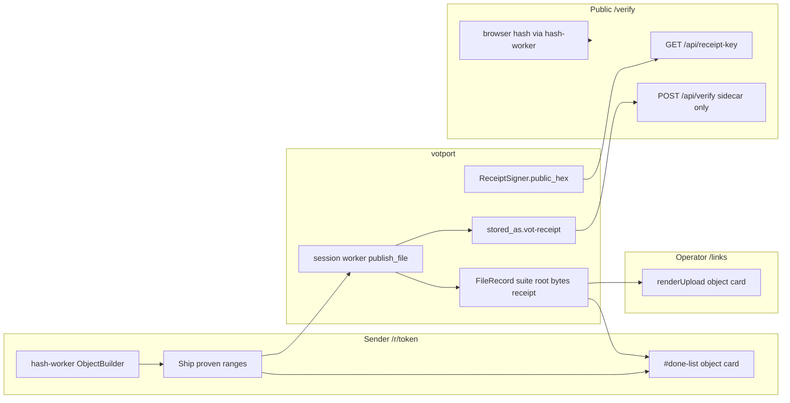
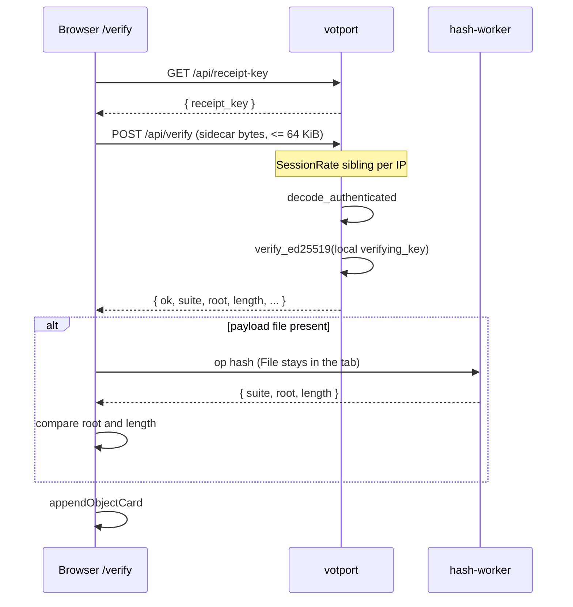

# Sender identity: the drop is an object, not a file that arrived

| Field | Value |
| --- | --- |
| Status | Ready to implement (design review: 0 open issues) |
| Date | 2026-08-22 |
| Head | `87c9f7b` Document the shipped admin, settings overlay, and 8 MiB ceiling (#36) |
| Continues | `docs/enterprise-ops.md` (phases 6+ shipped). This is a new product slice, not an ops follow-on. |
| Audience | Senior engineers who already know the votport tree |

Canonical copy. Implement from the PR Plan at the bottom. Merge PR 1 then PR 2, and PR 1 then PR 3.

## Overview

A votport drop already produces a VOT object identity: suite, 32-byte root, length, and a signed `.vot-receipt` sidecar. The sender page, the operator listing, and anyone holding the sidecar do not yet tell that story as one product. The sender sees a transfer in progress whose copy still talks like hashing percentages and technical failures. The listing on `/links` is a file manager with a buried `suite:root` line. Checking a receipt requires signing in to System or running `vot-receipt` in Rust.

This slice makes object identity the result of a drop, on three surfaces that share one shape. The sender page (`web/request.html` plus `web/assets/upload.js` plus `web/assets/hash-worker.js`) stays one verb, shows two honest rates, treats sleep and dead Wi-Fi as pause, and never says "chunk" to a human. After a drop, sender `#done-list` and operator `/links` render the same object card from fields that already exist on `FileRecord` / `FileView`. A public `/verify` page checks a sidecar (and, in the browser, the payload file) against this instance's verifying key, with no login and no payload upload.

## Background & Motivation

### Current state (verified in code)

Object identity is already on every completed upload. `server/src/store.rs` `FileRecord` persists:

| Field | Meaning |
| --- | --- |
| `path` | Name inside the uploaded package |
| `stored_as` | Path on disk relative to the receive root |
| `bytes` | Object length |
| `suite` | `"blake3"` or `"sha256"` from `session::suite_name` |
| `root` | Hex of the 32-byte object root |
| `receipt` | Whether `<stored_as>.vot-receipt` was written |
| `deleted` | Tombstone after admin or retention delete |

`UploadRecord.package_root` is the hex root of the verified package manifest. The sender in `upload.js` `sendDrop` builds **one VOT package per drop** (every selected file as one entry each), so a listing row has both a file object id and the drop's package root. They are different hashes (the package hashes its entries). The product card is the **file object**, not the package.

`server/src/api/admin.rs` `FileView` is that record plus a live `exists` boolean. `GET /api/admin/links` also returns `receipt_key: app.signer.public_hex`. `FinishReport.files` in `session.rs` `handle_finish` is `Vec<FileRecord>`, so the sender's `#done-list` already receives `suite`, `root`, `bytes`, `receipt`, `path`.

Receipts are already the right evidence. `ReceiptSigner::write_sidecar` (`server/src/receipt.rs`) writes canonical vot-receipt CBOR, ed25519-signed, `SubjectKind::Object`, `AssuranceLevel::Published`, `CommitProfile::Balanced`. The crate cap is `decode_authenticated` rejecting input longer than 65_536 bytes. The e2e `receipts_are_written_and_files_are_manageable` already round-trips `decode_authenticated` plus `verify_ed25519` against `listing["receipt_key"]`.

The sender already hashes in module workers with vot-wasm SIMD (`hash-worker.js` `ObjectBuilder(Suite.Blake3Bao64, ...)`), keeps eight range POSTs in flight (`UPLOADS_IN_FLIGHT = 8`), and hashes every file of a drop across the pool before announcing the package. Resume is keyed on the **package** root alone, not a file object id. In `upload.js` `sendDrop`, `rootHex` is `hex(packageId.root)` from `buildPackage(items).summary.objectId`; `saveResume` / `loadResume` use `votport-resume-${token}` and match `saved.root === rootHex`. The record carries `files` and `size` for the resume note. The package root covers every entry's path and bytes, so any edit to the selection produces a new root and a fresh session; `item.objectId` is never written to the record. `CHUNK_BYTES` is 8 MiB in `session.rs` and is advertised as `chunk_bytes` on `GET /api/r/{token}` and session create. Do not raise it.

Admin QR of the request URL already exists (`GET /api/admin/links/{id}/qr`, toggled from `page-links.js`). The sender does not need a QR of the link.

CSP is already `script-src 'self' 'wasm-unsafe-eval'` with `worker-src 'self'` in `app.rs`. Pages load only `/assets/*.js` as `type="module"`. No inline JS.

### Pain points

1. **The result looks like a file manager.** `showDone` in `upload.js` prints `path`, `formatBytes(file.bytes) · receipt ✓`, and `${file.suite}:${file.root}`. `renderUpload` in `page-links.js` prints `stored_as (bytes)`, a `receipt` badge, then the same `suite:root`, then a separate `package ${upload.package_root}` line. Same data, different card, easy to miss the identity.

2. **There is no public check.** System (`/system`) is a static shell; `#receipt-key` is filled only after `requireSession()` and `GET /api/admin/links` (`page-system.js`). `list_links` is admin-gated. Anyone who can load HTML does not get the hex. README tells a Rust programmer to call `decode_authenticated` then `verify_ed25519`. A stranger holding `report.pdf` plus `report.pdf.vot-receipt` has no page.

3. **Sender copy is still protocol-shaped.** `#phase` starts as "Preparing" then becomes `Sending ${position} of ${files.length}`. Per-file status is `hashing 0%` / `hashing 42%` / `ready` / byte counts. `postWithRetry` gives up after three attempts, then the submit handler hides `#progress-card`, re-enables Ship, and tells the sender to reselect files. Sleep, lock, and dead Wi-Fi therefore look like failure even though `saveResume` already holds the package root and session id. iOS Safari can kill a module worker when the tab is backgrounded; `worker.onerror` currently `stopWorkers` and fails the transfer.

4. **The word "chunk" leaks.** Sender-visible strings in `upload.js` do not currently print "chunk N", but the comment at the file-list status map still thinks in per-chunk updates, and a stalled NIC is not named pause. Operator `chunkTrouble` in `page-links.js` is telemetry for the admin ("N re-sent chunks") and stays operator-only.

### Product restated

A drop's result is an object identity. Three surfaces, one story:

1. Sender page as the product: one verb (Ship), two honest rates, pause not failure, invisible resume, human failure copy, iOS first-class. No new QR on the sender.
2. Object card on both sides after a drop: suite, hex root, length, receipt present, pasteable.
3. Public verify, no login: file plus sidecar (or sidecar plus this instance's published key) says yes or no. Hashing stays in the browser.

## Goals & Non-Goals

### Goals

1. One shared object-card renderer (`tag` / `rowClass` option, CSS on `.object-card`), driven by the existing `FileRecord` / `FileView` JSON (`suite`, `root`, `bytes`, `receipt`, plus a display name), used by sender `#done-list` (`li.done`) and operator `renderUpload` (`div.upload-file`).
2. A public verifying-key endpoint and a size-capped `POST` that runs `decode_authenticated` plus `verify_ed25519` against this process's `ReceiptSigner`, returning the attested identity as JSON.
3. A public `/verify` page that never uploads the payload file, hashes it locally with the existing vot-wasm worker path, and compares digest and length to the receipt.
4. Sender progress copy that names preparing versus sending, quotes two rates while both are happening, treats stall/sleep/offline as pause with automatic resume, and never shows the word "chunk" to a sender.
5. Tests that kill the guards they introduce: JSON contract, verify API (authz, size, signature, rate limit), done-card fields in `scripts/browser-e2e.mjs`, CSP still `script-src 'self'`.

### Non-goals

- Raising `CHUNK_BYTES` (8 MiB). Do not re-pin VOT inside these PRs.
- A JS crypto framework (tweetnacl, noble, WebCrypto ed25519 polyfill). The server verifies a tiny CBOR receipt.
- Uploading the payload file to `/api/verify`. That would make votport a free hashing farm and a privacy problem.
- Postgres, a new store backend, a dashboard rewrite, a component library.
- A schema bump. Object identity is already on `FileRecord`. Adding a concatenated `identity` column is forbidden unless a later PR proves a query cannot be served by `suite` + `root`.
- New directories under the data or receive roots. umask 022 and `tighten_dir` stay the rule if that changes.
- A sender-side QR of the request URL. Admin QR stays the way to hand the capability across a table.
- Changing `UPLOADS_IN_FLIGHT`, `LOOKAHEAD`, `HASH_READ_BYTES`, or the resume localStorage schema (`session`, `path`, `size`, `root`, `chunk`) where `root` is the package root. Do not retarget `saved.root` at the file object.
- Making `/api/verify` a general-purpose verifier for third-party keys. It checks **this instance's** `ReceiptSigner`.
- Rewriting dead `web/assets/admin.js` (no HTML page loads it after the multi-page admin). Live listing is `page-links.js`.
- Operator `chunkTrouble` copy on `/links` (connection-quality telemetry for admins). Sender-visible copy is the constraint.

## Proposed Design

### One identity shape

The object card is this client-side view, filled from existing JSON. No new field.

```js
// Canonical card model. All keys already exist on FileRecord / FileView
// except `name`, which the caller chooses. `bytes` is required; callers
// map verify JSON `length` to `bytes` before calling the helper.
{
  name: string,      // sender: file.path; operator: file.stored_as
  suite: string,     // "blake3" | "sha256"  (session::suite_name)
  root: string,      // 64 lowercase hex chars, never truncated in the DOM
  bytes: number,     // FileRecord.bytes only (no `length` fallback)
  receipt: boolean,  // FileRecord.receipt; verify page true after ok POST
}
```

Pasteable identity line, already what both UIs print:

```
blake3:<64 hex>
```

Click copies that line. Optional multiline clipboard (same click, `\n` joined) is **not** in this slice; one line matches today's `suite:root` and is what a human pastes into chat.

`package_root` stays on the operator upload row as a muted secondary line. It is not on the sender card and not on the verify result. Per-file packages make it easy to confuse with the object root.



### Shared renderer

New module `web/assets/object-card.js`, imported by `upload.js` and `page-links.js` (and later `verify.js`). CSP: `script-src 'self'`, `type="module"`, no inline handlers.

The listing cannot host a sender `<li>`. Operator `renderUpload` builds a `.uploads > li` whose files are `<div class="upload-file">` siblings of a separate `.file-id` div, styled by `.upload-file` / `.uploads li`, not `.files li`. The helper therefore takes a tag and class option, or fills a caller-created row. CSS targets `.object-card` itself.

```js
// web/assets/object-card.js
export function identityLine(file) {
  return `${file.suite}:${file.root}`; // full 64 hex; never ellipsize textContent
}

export function appendObjectCard(parent, file, options = {}) {
  // file: { name, suite, root, bytes, receipt }
  //   bytes is required. Callers map verify JSON length -> bytes.
  // options.tag: 'li' (sender #done-list, verify #verify-list) or 'div' (listing)
  // options.rowClass: extra classes besides 'object-card'
  //   sender: 'done'; listing: 'upload-file'; verify: 'done'
  // options.status: preformatted status string (field parity is the caller's)
  // options.extras: Node[] inserted after the status (operator badges/buttons)
}
```

Field parity (do not mix these):

| Surface | Tag / classes | `name` | `.status` | extras | package line |
| --- | --- | --- | --- | --- | --- |
| Sender `#done-list` | `li.done.object-card` | `file.path` | `formatBytes(bytes)` plus ` · receipt ✓` when `receipt` | none | none |
| Operator listing | `div.upload-file.object-card` | `file.stored_as` | `formatBytes(bytes)` only (no receipt mark, no bytes in the name) | existing `exists` badge, `receipt` badge, Delete file | muted `package ${upload.package_root}` on the parent upload `<li>`, **outside** the card |
| Verify `#verify-list` | `li.done.object-card` | payload name or sidecar name | `formatBytes(bytes)` plus ` · receipt ✓` | none | none |

Sender markup (full 64 hex in the DOM; CSS may wrap, must not truncate `textContent`):

```html
<li class="done object-card">
  <span><!-- path --></span>
  <span class="status"><!-- e.g. 21 B · receipt ✓ --></span>
  <div class="mono muted file-id" title="Copy identity" role="button" tabindex="0">blake3:<64 hex></div>
</li>
```

Operator file row (inside the existing upload `<li>`, which keeps `.upload-head`):

```html
<div class="upload-file object-card">
  <span><!-- stored_as --></span>
  <span class="status"><!-- bytes only --></span>
  <!-- extras: missing badge, receipt badge, Delete file -->
  <div class="mono muted file-id" title="Copy identity" role="button" tabindex="0">blake3:<64 hex></div>
</div>
```

`style.css` adds layout on `.object-card` (flex wrap, name min-width 0, `.status` flex none, `.file-id` flex-basis 100%, cursor pointer). Do not rely on `.files li` alone to style the listing. Keep `.files li` rules for the sender list. Do not rename `.file-id`, `#done-card`, `#done-list`, `.upload-file`. Grep `web/assets/*.js` and `web/*.html` before touching any of those.

`showDone` loops `appendObjectCard($('done-list'), { name: file.path, suite, root, bytes, receipt }, { tag: 'li', rowClass: 'done', status: senderStatus })`.

`renderUpload` appends the card into the upload `<li>` with `{ tag: 'div', rowClass: 'upload-file', status: formatBytes(file.bytes), extras }`. It no longer puts bytes in the name span and no longer duplicates the receipt mark in `.status`. Keep the upload-level head (when, duration, Clear record) and the muted package line under the cards.

`formatBytes` is currently copied in `upload.js` and `admin-common.js`. PR 1 may import a tiny `formatBytes` from `object-card.js` **or** pass a preformatted `options.status`. Do not introduce a third independent copy if both call sites are already open. The helper does not read `file.length`.

### Public verify

#### Why this shape

The suggested pair is `GET /api/receipt-key` plus `POST /api/verify`. Defend it:

- The hex is meant to be public (`ReceiptSigner.public_hex` is the key id inside every sidecar). System and `GET /api/admin/links` stay admin-gated; they are not a public publication of the key. `/api/receipt-key` is the first unauthenticated read of `app.signer.public_hex`. No cookies, no `X-Votport`. Putting the only copy behind admin auth is what forces a login to check a sidecar.
- The server already depends on `vot-receipt`. Decoding 64 KiB of CBOR and one ed25519 verify is microseconds. The browser already has vot-wasm for hashing. Splitting those jobs keeps the server from hashing stranger payloads.
- A single `POST /api/verify` that accepted the payload file would be a hashing farm, a bandwidth bill, and a new body-limit exception next to `MAX_CHUNK_BODY_BYTES`. Rejected.
- Client-only verify would need an ed25519 implementation in JS. Rejected by the ponytail rule.

#### Routes

Add to `app::router` in `server/src/app.rs`, next to the other public routes, still under the existing `DefaultBodyLimit::max(64 * 1024)` (65_536 bytes, which is exactly the `decode_authenticated` cap of `> 65_536` rejected). Serve the page with the same `serve_page` helper (CSP, `nosniff`, `no-referrer`, `no-cache`).

| Method | Path | Auth | Body | Handler |
| --- | --- | --- | --- | --- |
| GET | `/verify` | none | | `serve_page(web_root/verify.html)` |
| GET | `/api/receipt-key` | none | | `api::receipt_key` |
| POST | `/api/verify` | none | raw sidecar bytes, `Content-Type: application/octet-stream` | `api::verify_receipt` |

Do not put these under `/api/admin`. Do not require `X-Votport`. Do not set cookies.

Handlers live in a new `server/src/api/verify.rs`, exported from `api/mod.rs` the same way `upload` handlers are. Signing stays in `receipt.rs`. HTTP stays in `api/`.

#### GET /api/receipt-key

```json
{ "receipt_key": "<64 lowercase hex>" }
```

Value is `app.signer.public_hex`, the same string `list_links` already returns as `receipt_key` to an admin session. System keeps fetching it via `GET /api/admin/links` (no behavior change). Both strings must remain equal to this process's signer. The public publication is this GET: no cookies, no `X-Votport`, no admin role. `/system` HTML does not contain the hex.

#### POST /api/verify

1. Resolve client IP with existing `client_ip(&headers, &peer)` (rightmost `X-Forwarded-For` only from loopback/private/ULA peers).
2. `app.verify_rate.allow(&ip)` must be true. `verify_rate` is a **second** `SessionRate` on `App`, not the same map as session creation. Reuse the type (`MAX_PER_WINDOW = 20`, `WINDOW = 600s`, `TABLE_CAP = 4096`). A sender who just created sessions must not be starved of receipt checks, and a verifier must not starve upload creates. Consume budget on every POST, including bodies that will 422, same as `create_session`.
3. Reject empty body (`422`). The router already 413s above 64 KiB.
4. `vot_receipt::decode_authenticated(&body)`. On `Error::TooLarge` / `InvalidEncoding` / `NonCanonical` return `422` `{ "error": "This is not a vot-receipt." }`.
5. `vot_receipt::verify_ed25519(&decoded, &app.signer.verifying_key())`. Add `ReceiptSigner::verifying_key(&self) -> ed25519_dalek::VerifyingKey` that returns `self.key.verifying_key()`. Do not hex-decode `public_hex` on the hot path. On `Authentication` / `UnexpectedScheme` / `InvalidKey` return `422` `{ "error": "This receipt was not issued by this server." }`. Other crate errors: `{ "error": "This receipt could not be checked." }`.
6. Success JSON (200):

```json
{
  "ok": true,
  "suite": "blake3",
  "root": "<64 hex>",
  "length": 12345,
  "subject_kind": "object",
  "assurance": "published",
  "profile": "balanced",
  "observed_at": "2026-08-22T04:05:06Z"
}
```

`suite` from existing `session::suite_name(receipt.suite_id)`. `root` is `hex::encode(receipt.subject_digest)` (64 lowercase hex). `length` is `receipt.subject_length`. The verify page maps `bytes: result.length` before `appendObjectCard`; the helper never reads `length`.

`vot-receipt` at pin `d3c18a4` exposes `SubjectKind` / `AssuranceLevel` / `CommitProfile` as `repr(u8)` with no serde aliases and no `Display`. Do not `format!("{:?}", …)` (`Object` / `Published` / `Balanced`). Explicit match, and tests for the strings:

| Rust | JSON |
| --- | --- |
| `SubjectKind::Object` | `"object"` |
| `SubjectKind::Package` | `"package"` |
| `AssuranceLevel::Admitted` | `"admitted"` |
| `AssuranceLevel::TransitVerified` | `"transit_verified"` |
| `AssuranceLevel::Durable` | `"durable"` |
| `AssuranceLevel::AtRestVerified` | `"at_rest_verified"` |
| `AssuranceLevel::Published` | `"published"` |
| `CommitProfile::Fast` | `"fast"` |
| `CommitProfile::Balanced` | `"balanced"` |
| `CommitProfile::Strict` | `"strict"` |

votport only issues Object / Published / Balanced. Still match every variant so a future sidecar cannot leak Debug casing. Unknown numeric values: 422 `"This receipt could not be checked."` rather than a raw number.

Do not `spawn_blocking`. This is not argon2. Do not write `store.audit` (unauthenticated log injection / disk fill). `tracing::info!(target: "audit", event = "receipt_checked", ok = true, suite, length)` is enough.

HMAC receipts (`AuthScheme::HmacSha256`) fail `verify_ed25519` with `UnexpectedScheme`. votport only issues ed25519. That is the correct 422.

#### Verify page

New `web/verify.html` cloned from the **sender** shell (`request.html`: `.hero` + `.sheet` + masthead), not the admin shell. Public product, same brand. New `web/assets/verify.js` as `type="module"`.

Load-bearing new ids (do not recycle `#drop` / `#file-input` from `request.html`; those pages can never share a DOM):

| Id | Role |
| --- | --- |
| `#verify-drop` | Drop zone (reuse class `drop`) |
| `#payload-input` | `<input type="file">` for the object |
| `#sidecar-input` | `<input type="file" accept=".vot-receipt,application/octet-stream">` |
| `#receipt-key` | Mono public key, filled from GET `/api/receipt-key` |
| `#check` | One verb button, disabled until a sidecar is present |
| `#verify-error` | class `error` |
| `#verify-result` | class `card`, hidden until a check finishes; add `.ok` only when **both** signature and payload-file digest/length match |
| `#verify-list` | `ul.files` for the object card |

One payload plus one sidecar per Check. Extra dropped files are ignored with a visible sentence: "Only one file and one receipt are checked. Extra files were ignored." `SessionRate` is 20 POSTs / 10 min / IP (consumed even on 422); a folder of sidecars is not a batch API.

Flow:

1. On load, `GET /api/receipt-key` fills `#receipt-key`. Failure: "Could not reach the server. Reload the page to try again." (same tone as `upload.js` link_info retries).
2. User drops or picks files. Pair at most one payload with one `name.vot-receipt` (suffix match, case-sensitive as on disk). A lone sidecar is enough to check issuance. A lone payload asks for the sidecar. The two inputs remain available when names do not match.
3. Check:
   - `POST /api/verify` with the sidecar `Uint8Array` as the body. No JSON wrapper.
   - If the POST is not `ok`, show `#verify-error` with the server `error` string (already human). Do not add `.ok` to `#verify-result`.
   - If there is no payload file, render the object card from `{ name: sidecarName, suite: result.suite, root: result.root, bytes: result.length, receipt: true }`. `#verify-result` stays `card` **without** `.ok`. Muted line: "Receipt is from this server. Drop the file to check the bytes."
   - If there is a payload file, hash it with a **tiny worker client in `verify.js`** (below). Compare hex root and numeric length. Match: add `.ok` to `#verify-result`. Mismatch: card stays, `#verify-result` is not `.ok`, copy "This file is not the object in the receipt."
4. Never `fetch` the payload. Never show "chunk". Hash stall copy is "Preparing".

Worker client in `verify.js` (do not import `upload.js`; that module starts work at load). `hash-worker.js` posts `{ req, step }` every 8 MiB and only the last message has `done: { suite, root, length }` (`root` is `Uint8Array`, `length` is `bigint`, `suite` is numeric `Suite.Blake3Bao64`). Resolving the first message yields `undefined` `done` and a false mismatch.

Required client:

- `new Worker('/assets/hash-worker.js', { type: 'module' })`
- Ignore messages where `data.step !== undefined`
- Reject on `data.error`
- Hex-encode `done.root`; `Number(done.length)` for the compare
- Then `op: 'drop'` (and terminate). `ObjectBuilder` pins a merkle tree until `drop`; same RAM as upload, acceptable, not a VOT re-pin
- Do not `init()` vot-wasm on `window`. The worker already `init()`s itself. A main-thread wasm compile is unused unless a later change needs `ObjectId` in the page.

`verify.js` may import `appendObjectCard` / `identityLine` from `object-card.js`. Suite on this worker is always Blake3Bao64; votport only issues `blake3`.

System card `#receipt-key` stays. Add one muted sentence and a same-origin link: "Anyone can check a sidecar at `/verify`." Sender `#done-card` does not grow a verify CTA in this slice.



### Sender progress UX

All of this is `web/request.html` copy plus `web/assets/upload.js` control flow. No protocol change. `saveResume` / `loadResume` / `clearResume` stay keyed on the **package** root (`saved.root` is `hex(packageId.root)`); the per-file `path` key went away with the one-package-per-drop sender. Do not retarget `saved.root` at `item.objectId`.

#### One verb, two rates, two phases

Keep `#send` label **Ship**. Keep `#progress-card`, `#phase`, `#meter-fill`, `#progress-note`, `#cancel`.

`#phase` is only:

| Condition | `#phase` |
| --- | --- |
| Hashing the first bytes, no range POST yet | `Preparing` |
| At least one range POST has been accepted or is in flight | `Sending` |
| No progress on the send window for `RATE_WINDOW_MS` (4000), or `navigator.onLine === false`, or a transient fetch failure is backing off | `Paused` |
| User confirmed cancel | (existing cancel path) |

`#progress-note` is the honest rates. `hashRate` and `sendRate` already exist (`makeRate`, trailing 4 s). Today the hash rate is shown only while `sent === 0`, then only the send rate. With `LOOKAHEAD = 2` both run at once. Show both while both have a sample in the window:

```
preparing 110 MB/s · sending 42 MB/s · 800 MiB of 2.1 GiB · 8m left
```

When hashing has finished, drop the preparing clause. When `formatRate` would print a zero, print nothing for that clause and let `#phase` say `Paused`. Do not print `0 B/s`. Decimal units stay (`formatRate`); sizes stay binary (`formatBytes`).

Per-file `.status` in `#file-list`:

| State | Status text |
| --- | --- |
| Queued | `formatBytes(size)` (already) |
| Hashing | `Preparing` (no percent, no "hashing") |
| Hash done, not yet sending | `Ready` |
| Sending | `formatBytes(fileSent) / formatBytes(size)` (already) |
| Delivered | `Delivered` plus the existing `·` receipt mark after finish, or keep `delivered ✓` without the word chunk |

Never: `hashing 0%`, `chunk 14`, `resuming…` as a protocol leak. Resume can say `Continuing` if a `loadResume` session re-attaches.

#### Pause, not failure

`postWithRetry` today retries 3 times on network errors, 500, and 429, then throws. The submit handler then hides `#progress-card` and tells the sender to reselect. `sendOne` also calls `postWithRetry(`/api/session/${sessionId}/begin`, {}, 1)`: `attempts = 1` means a single 500 or dead Wi-Fi during re-attach already sets `sessionId = null` and opens a second session while the first may still be alive. Unbounded retry of `postWithRetry` does not fix that call site.

Change the **transient** path inside `runUpload` / `sendOne` / `uploadEntryChunks` so a throw does not escape to that fail UI. Keep `#progress-card` visible, `#phase = Paused`, backoff 1s, 2s, 4s, 8s, cap 15s, no attempt cap for transient, until success or user cancel.

`begin` versus range POST must not be mixed. Table:

| Call | network / 500 / 429 / `AbortError` with `cancelled === false` / `navigator.onLine === false` | 404, 410, or body `unknown or expired session` | other 4xx (422, 409, 401, ...) |
| --- | --- | --- | --- |
| `POST /api/session/{sessionId}/begin` | Pause. Retry the **same** `sessionId`. Do **not** pass `attempts = 1`. Do not create a new session. | Set `sessionId = null` and fall through to the existing `if (!sessionId)` block in `sendOne` (`upload.js` ~578-609): `POST /api/r/{token}/session`, `saveResume`, **seal, every page, begin**, then `uploadEntryChunks` from **that** begin's `covered_bytes` (0 if the old session was swept). Do not jump to chunks after create alone. If create itself returns 404/410/gone, fatal + `clearResume()` plus the discarded-partial sentence. | Fatal. `fail()`. |
| `POST /api/session/{sessionId}/chunk?...` | Pause. Retry the **same** session, same `entry` and `offset`. Do not `controller.abort()`. | Fatal expired: `clearResume()`, discarded-partial sentence. This is not the begin re-attach path. | Fatal (chunk 4xx other than 429 stays fatal): "This file could not be verified. Try sending it again." |
| `seal` / `page` / `finish` on an **existing** session | Pause. Retry the same session. | Fatal expired. This is not "skip seal on a replacement session." A replacement session (begin 404 path above) still posts seal and pages before its begin. | Fatal. |

Hash-worker `onerror` is **not** a second continuation. It only recovers trees (iOS section). The send loop is the only place that `begin`s and calls `uploadEntryChunks`. File changed underfoot stays fatal (`"${path}" changed while uploading. Pick it again.`). `error.cancelled` stays user-cancel only.

Keep `document.visibilitychange` re-acquiring `wakeLock` while `uploading`. If the tab becomes visible and workers are dead, call the same `onerror` recovery (snapshot / restart / re-hash / signal ready), not a second `uploadEntryChunks`. Do not `controller.abort()` from visibility or from worker death.

#### iOS Safari first-class

The floor is already written in `upload.js` wasm init failure: Safari 16.4, Chrome 91, Firefox 114 (module workers plus WASM SIMD). Keep that sentence.

Concrete pass, not a slogan:

1. **Module workers stay.** `new Worker('/assets/hash-worker.js', { type: 'module' })` is the Safari 15+ path. Do not switch to classic workers.
2. **Worker death is pause, with a cap, and one owner.** Today `worker.onerror` calls `stopWorkers`, which `terminate()`s the pool, clears `workerByPath`, and rejects every pending `workerCall` with `Cancelled` (looks like user cancel). `LOOKAHEAD = 2` means up to two later files already have `objectId` in JS and trees pinned on other workers; after a full pool restart `workerFor({op:'prove'})` returns `undefined` and `workerCall` rejects `Cancelled`. In-flight `prove` / range POSTs from `UPLOADS_IN_FLIGHT = 8` also reject. If `onerror` itself then `begin`s and calls `uploadEntryChunks` while the send loop also retries `uploadEntryChunks`, two chunk loops share one `sessionId`. If the throw wins, `#upload-error` still appears. **One owner: the send loop continues. `onerror` only restores trees.**
3. **`onerror` (and unexpected terminate) only:**
   - Snapshot **every path still in `workerByPath` plus the send cursor** (the path `sendOne` is on, if not already in the map). If a recovery is already running, do not start a second pool restart; the send loop waits on the same ready signal.
   - If `!uploading || cancelled`, keep today's stop path.
   - If `workerRestarts >= 3` (counter from the start of this `runUpload`), reject in-flight calls with a **fatal** (not `Cancelled`): "Verification stopped. Try sending again." Do not loop on a 404 of `/assets/hash-worker.js`.
   - Else increment `workerRestarts`, set `#phase` to `Paused` then `Preparing`. **Do not `controller.abort()`.**
   - `stopWorkers` must reject in-flight `workerCall`s with a distinct pause/recovery error, **not** `Cancelled`. `error.cancelled` is user-cancel only.
   - `startWorkers()`. Re-`hash` every snapshotted path that is still in `picked` and not yet delivered (trees are gone; JS `objectId` is not a tree).
   - Signal **ready** (one barrier the send loop awaits). **Stop. Do not `begin`. Do not call `uploadEntryChunks`.**
4. **Send loop (`uploadEntryChunks` / `sendOne` / `workerCall`) only:**
   - Catch the pause/recovery error. Do not treat it as `error.cancelled`. Do not let it reach `fail()` unless the fatal restart cap fired.
   - Await the ready signal (trees exist again).
   - Re-`begin` using the pause table: network/500/429 retry the same `sessionId`; 404/410/expired fall through to `if (!sessionId)` (create, `saveResume`, seal, pages, begin).
   - Retry `prove` / `uploadEntryChunks` from the **new** `covered_bytes` returned by that begin. Do not reuse a stale offset from before the death.
   - If `prove` fails because a tree is not ready yet, or a worker dies again: that is pause again, not `Cancelled`. Wait for ready, re-begin, retry. Do not start a second `uploadEntryChunks` from `onerror`.
5. **Do not `controller.abort()` except on user cancel.** Sleep, visibility, and worker death must not abort in-flight POSTs.
6. **Wake lock stays best-effort** on the Ship click (`keepAwake`). iOS may ignore it. Pause copy covers that case.
7. **Folder picker.** `#folder-input` `webkitdirectory` is best-effort on iOS; files and the `#drop` entries path stay the primary. No new picker UI.
8. **Clipboard.** Object-card copy runs from a click (user gesture) so Safari allows `navigator.clipboard.writeText`.
9. **Viewport.** `request.html` already has `viewport-fit=cover`. Do not add `100vh` traps; existing flex column in `#uploader` stays.

Resume record (`session`, `path`, `size`, `root` = package root, `chunk`) is what re-attach uses. Do not write `item.objectId` into it.

Manual check listed under Rollout: iPhone Safari 16.4+ lock mid-send, unlock, confirm `#phase` is `Paused` then `Sending` / `Preparing` without a red `#upload-error`.

#### Human failure copy

Map remaining fatals. Do not interpolate raw `SessionError` text when it contains "proof" or "chunk".

| Trigger | Sender sentence |
| --- | --- |
| User cancel | `Transfer cancelled.` (existing `Cancelled` class) |
| Expired session | Keep today's "unknown or expired session" plus "The partial transfer was discarded, reselect the same files to send them again from the start." |
| File mutated | `"${path}" changed while uploading. Pick it again.` |
| Path collision / portable path | Keep the existing human sentences in `validateComponent` / `buildPackage` |
| 422/409 from verify_range or publish | `This file could not be verified. Try sending it again.` |
| wasm init | Keep the Safari 16.4 / Chrome 91 / Firefox 114 sentence |
| Link closed 404/410 | Keep the `#closed` card |
| After a real fatal that left a resume record | Keep `showResumeNote`: interrupted transfer of `"${saved.path}"` is held, select the same file to continue |

`fail()` still writes `#upload-error`. It is not used for pause.

### What we are not changing

- `session.rs` `CHUNK_BYTES`, `MAX_CHUNK_BODY_BYTES`, worker thread model, `publish_file`, sidecar write.
- Store schema: `SCHEMA_VERSION` stays `5` (`server/src/store.rs`, `u64`; v4 `settings`, v5 `principals`). No migration, no `identity` column, no new table. Do not stamp 3 (that would be a forbidden downgrade). `FileRecord` fields stay.
- Admin QR, link create form, tenants, audit, settings overlay.
- `UPLOADS_IN_FLIGHT`, `LOOKAHEAD`, per-file packages.
- Resume localStorage key `votport-resume-${token}` and record shape `{ session, path, size, root, chunk }` where `root` is the **package** root. PR 3 does not retarget `saved.root` at the file object.

## API / Interface Changes

### Existing JSON (no change, this is the card contract)

`POST /api/session/{sid}/finish` body `files[]` (`FinishReport` / `FileRecord`):

```json
{
  "path": "Résumé Draft.pdf",
  "stored_as": "clients/alex/Résumé Draft.pdf",
  "bytes": 21,
  "suite": "blake3",
  "root": "<64 lowercase hex>",
  "receipt": true,
  "deleted": false
}
```

`GET /api/admin/links` `links[].uploads[].files[]` (`FileView`):

```json
{
  "path": "Résumé Draft.pdf",
  "stored_as": "clients/alex/Résumé Draft.pdf",
  "bytes": 21,
  "suite": "blake3",
  "root": "<64 lowercase hex>",
  "receipt": true,
  "exists": true
}
```

Top-level `receipt_key` on that admin listing stays.

### New

`GET /api/receipt-key` 200:

```json
{ "receipt_key": "<64 lowercase hex>" }
```

`POST /api/verify`

- Request: raw bytes, `Content-Type: application/octet-stream`, max 65_536 bytes (router default).
- 200: see Proposed Design.
- 422: `{ "error": "<human sentence>" }`
- 413: body over the default limit (axum empty; the page treats non-JSON as "This is not a vot-receipt.")
- 429: `{ "error": "too many checks from your address; try again later" }`

No query parameters. No JSON request body. No multipart.

## Data Model Changes

None. No schema bump. No new SQLite table. No new column on `links` or embedded upload JSON.

`App` gains `pub verify_rate: crate::api::session_rate::SessionRate` in `app::build`, constructed with `SessionRate::new()`. That is process memory, same as `session_rate`.

`ReceiptSigner` gains `verifying_key()`. The 32-byte seed file `data/receipt.key` is unchanged.

No new directories. umask 022 and `tighten_dir` are not invoked.

## Alternatives Considered

### 1. Client-only verify with a JS ed25519 library

Ship noble-ed25519 (or similar) in `/assets/vendor`, decode CBOR in JS, verify in the tab. No `POST /api/verify`.

- Pros: server stays out of the check; works offline after the key is fetched.
- Cons: new JS crypto (explicitly out of scope); CBOR decoder to write and test against `NonCanonical`; vendor bytes and CSP review; still need `GET /api/receipt-key`. Offline is not a product requirement (the sender already needs the network).
- Decision: reject. Reuse `vot-receipt` on the server, vot-wasm only for hashing.

### 2. `POST /api/verify` accepts the payload file (or a hash the client claims)

Server hashes, or trusts a client-supplied digest.

- Pros: one round trip; "the server said yes" includes the bytes.
- Cons: hashing farm; new body limit far above 64 KiB; privacy; duplicates work `hash-worker.js` already does; a claimed digest without hashing is theater.
- Decision: reject. Sidecar only on the wire. Browser compares digest/length.

### 3. Concatenated `identity` column or a new `objects` table

Persist `blake3:<hex>` next to `suite` and `root`, or normalize files out of the link JSON.

- Pros: listing query by identity later; prettier API.
- Cons: schema bump for a string the client already concatenates; `docs/multi-tenancy.md` parked splitting uploads out of the link row.
- Decision: reject. Cite `FileRecord.suite` + `FileRecord.root` + `FileRecord.bytes`.

### 4. Put verify on `/api/admin/receipts/verify` and keep the key admin-only

- Pros: no new public surface.
- Cons: fails the product sentence "Public verify, no login." System and `list_links` stay admin-gated; they do not publish the hex to a stranger. The key id is already inside every sidecar, which is why a public GET of the same `public_hex` is the product.
- Decision: reject.

### 5. Generalize `SessionRate` into a parameterized `IpWindow<const N, const W>`

- Pros: one type, two constants.
- Cons: extra abstraction for a 50-line map that already does the job. Two `SessionRate` instances share the same 20/10 min numbers, which is the intended cap.
- Decision: reuse the type, second field on `App`. If the caps must diverge later, then parameterize.

## Security & Privacy Considerations

Threats and mitigations:

| Severity | Threat | Mitigation |
| --- | --- | --- |
| Medium | Unauthenticated CPU DoS via `POST /api/verify` | 64 KiB body cap (router + crate), `SessionRate` sibling 20/10 min/IP using `client_ip` (unspoofable XFF from public peers), ed25519 verify is tens of microseconds, no hashing, no `store.audit` |
| Medium | Using votport as a free hasher | Payload never uploaded. Worker runs in the caller's browser. |
| Low | Key disclosure | Intentional. `public_hex` is the receipt key id inside every sidecar. System and `list_links` stay admin-gated; `GET /api/receipt-key` is the public publication of the same `app.signer.public_hex`. No cookies, no `X-Votport`. |
| Low | Cross-instance receipt confused as local | `verify_ed25519` against **this** `verifying_key` only. Foreign receipts 422 "not issued by this server." |
| Low | Referrer leak of `/r/{token}` into `/verify` | Existing `Referrer-Policy: no-referrer` on pages and `/assets`. |
| Low | CSRF of `POST /api/verify` | No cookies, no session mutation, no side effect except rate-budget spend. Same-origin page is the product; a third-party site can spend its visitors' IP budget, which the per-IP cap bounds. |
| Low | HMAC or truncated envelopes | Crate `UnexpectedScheme` / `InvalidEncoding` mapped to human 422. |
| Info | Verify page indexing | Keep `<meta name="robots" content="noindex">` like `request.html`. |

CSP unchanged. New JS only under `/assets`. No inline handlers on `#verify-drop` (same pattern as `#drop`: `addEventListener` in the module).

Do not log sidecar bytes or object roots at info in a way that dumps 64 KiB. `length` and `suite` are enough.

## Observability

- `tracing::info!(target: "audit", event = "receipt_checked", ok, suite, length)` on every completed POST (after decode+verify, not on 413). No `Store::audit` row.
- 429s already have the HTTP status; no extra metric required in this slice.
- Sender pause is a UI state, not a server event. Existing session events (`interrupted`, `cancelled`, `rejected`) plus `replayed_chunks` remain the operator view of a flaky line.
- `/metrics` is unchanged. Optional follow-on: `votport_receipt_checks_total`. Not in these PRs.

Alerting: none. A scrape of 429 on `/api/verify` is enough if someone ever cares.

## Rollout Plan

No feature flag. Three PRs, merge in order **1 then 2** and **1 then 3**. PR 2 and PR 3 must not share a PR. PR 3 may merge without PR 2. They are independently **reviewable** and **rollbackable**, not mergeable in any order: landing PR 2 first 404s `object-card.js` on `/verify`. Card first.

Each PR: fmt, clippy `-D warnings`, `cargo test`, eslint on `web/assets/*.js`, docker build. After merge, rebuild the image and verify **served bytes** (`scripts/prod-check.mjs` still renders `/links`; add a `curl -sI /verify` and `curl -s /api/receipt-key` check in the deploy notes, not a new required script unless PR 2 wants it).

Staged:

1. PR 1 ships the card on both sides against today's JSON. Rollback: revert; listing and done-list still function if `object-card.js` 404s would break both pages, so keep the helper tiny and covered by browser-e2e.
2. PR 2 ships `/verify` + public API. Depends on PR 1. Rollback: revert routes and files; admin listing and sender are unaffected. `App.verify_rate` removal is the revert.
3. PR 3 ships sender copy and pause. Depends on PR 1 (both edit `upload.js`). Does not depend on PR 2. Rollback: revert `upload.js` / `request.html` copy only. Resume schema is unchanged so a mixed old/new sender still re-attaches.

iOS pass is a manual gate on PR 3 (lock screen mid-send). Chromium `scripts/browser-e2e.mjs` stays CI. WebKit Playwright is optional if the runner already has it; do not add a new CI browser in this slice unless it is free.

## Open Questions

1. **Done-card CTA to `/verify`.** Product says the listing and the sender show the same card, not that the sender must advertise the public checker. Default: System links to `/verify`; sender does not. Easy to add a muted "Check this receipt at /verify" later without a schema change.
2. **Operator `chunkTrouble` wording.** Out of sender scope. If we want zero occurrences of "chunk" in `web/`, PR 3 can say "re-sent ranges" / "rejected ranges" in `page-links.js`. Default: leave admin telemetry.
3. **WebKit in CI.** Optional. The wasm fail message already names Safari 16.4. A locked iPhone is the real pause test.
4. **Foreign key paste on `/verify`.** Out of scope. This instance's key only.

## Key Decisions

1. **No schema bump.** `SCHEMA_VERSION` stays `5`. `FileRecord.{suite,root,bytes,receipt,path,stored_as}` is the object. `FileView` adds `exists`. Verify JSON uses `length` for `subject_length`; `verify.js` maps `bytes: result.length`. The helper accepts `bytes` only.
2. **Shared module with a tag/class option.** `appendObjectCard` takes `tag` (`li` vs `div`) and `rowClass` (`done` vs `upload-file`). CSS targets `.object-card`. Field parity: sender `name=path` + status `bytes · receipt ✓`; operator `name=stored_as` + status `bytes` only, extras for exists/receipt/Delete, package line outside the card. Full `identityLine` (64 hex) in the DOM.
3. **Public `GET /api/receipt-key` and sidecar-only `POST /api/verify`.** System and `list_links` stay admin-gated. This GET is the public publication of `app.signer.public_hex` (no cookies, no `X-Votport`). Server runs `decode_authenticated` + `verify_ed25519`. Browser hashes with `hash-worker.js` via a verify.js client that ignores `step`. No `upload.js` import. No window `init()`.
4. **Second `SessionRate` instance as `App.verify_rate`.** Same constants, separate map, `client_ip` unchanged. Consume budget on every POST. One payload + one sidecar per Check.
5. **`ReceiptSigner::verifying_key()`.** Do not re-parse `public_hex`. Lowercase JSON enums via an explicit match table, not Debug.
6. **Pause is a client state.** Resume matches **package** root + path; schema frozen; PR 3 does not retarget `saved.root`. `begin`: network/500/429 retry same `sessionId` (no `attempts = 1`); 404/410/expired falls through to `if (!sessionId)` (create, `saveResume`, seal, pages, begin) and `uploadEntryChunks` from that begin's `covered_bytes`. Create 404/410/gone is fatal + `clearResume()`. Chunk 4xx other than 429 stays fatal. Fatal path still uses `fail()` + `showResumeNote`.
7. **iOS worker death: one owner.** `onerror` only snapshots `workerByPath` plus send cursor, restarts the pool (cap 3), re-hashes, signals ready. The send loop catches the pause error (not `Cancelled`), waits for ready, re-`begin`s (pause table), retries `prove` / `uploadEntryChunks` from the new `covered_bytes`. Do not start a second `uploadEntryChunks` from `onerror`. Do not `controller.abort()` on this path.
8. **No sender QR.** Admin QR remains the table-handoff.
9. **Load-bearing ids stay.** New ids only on `verify.html`. Grep before rename.
10. **Dead `admin.js` is not in the DAG.** Live listing is `page-links.js`.
11. **Do not raise `CHUNK_BYTES`.** Do not re-pin VOT inside these PRs.
12. **Three PRs, card first.** Merge 1 then 2, and 1 then 3. 2 and 3 must not share a PR. 3 may merge without 2. Independently reviewable and rollbackable, not mergeable in any order.

## Risks

| Severity | Risk | Mitigation |
| --- | --- | --- |
| High | iOS kills the hash worker and today's `onerror` fails the drop, or `onerror` and the send loop both call `uploadEntryChunks` | PR 3: `onerror` only restores trees and signals ready (cap 3). Send loop waits, re-`begin`s, retries from the new `covered_bytes`. Pause error is not `Cancelled`. No second chunk loop. No `controller.abort()`. |
| Medium | Unbounded transient retry looks "stuck" | `#phase = Paused`, visible rate window, Cancel still works, cap backoff at 15s |
| Medium | `begin(..., 1)` opens a second session on one 500 | Do not pass `attempts = 1` for transient. Same `sessionId` until 404/410/expired. |
| Medium | Shared `object-card.js` 404 breaks sender and listing together | Tiny module, browser-e2e asserts `#done-list .file-id` full 64 hex, cache `no-cache` already on `/assets`. PR 2 does not merge before PR 1. |
| Low | Sidecar / payload name mismatch | Two explicit file inputs; extra files ignored with a sentence; one pair per Check |
| Low | `DefaultBodyLimit` 64 KiB and crate cap differ by one byte interpretation | Crate rejects `len > 65_536`; axum max is `64 * 1024`. Same number. Test 65_537 through the HTTP stack. |
| Low | Sidecar-only looking like a full byte check | `#verify-result.ok` only when signature **and** file match. Sidecar-only is `#verify-result:not(.ok)`. Helper is `bytes` only. |

## References

- `web/request.html`, `web/assets/upload.js`, `web/assets/hash-worker.js`
- `web/assets/page-links.js`, `web/links.html`
- `web/assets/style.css` (tokens `--ok`, `--progress`, `.card.ok`, `.file-id`, `.badge`, `.drop`)
- `server/src/receipt.rs` (`ReceiptSigner`, `write_sidecar`, existing round-trip test)
- `server/src/app.rs` (`router`, `CSP`, `DefaultBodyLimit::max(64 * 1024)`)
- `server/src/api/admin.rs` (`FileView`, `UploadView`, `list_links` `receipt_key`)
- `server/src/api/session_rate.rs` (`SessionRate`, `MAX_PER_WINDOW`, tests)
- `server/src/api/upload.rs` (`link_info.chunk_bytes`, `create_session`, `session_creation_is_rate_limited_per_ip`)
- `server/src/session.rs` (`CHUNK_BYTES`, `suite_name`, `FinishReport`, `publish_file`)
- `server/src/store.rs` (`FileRecord`, `UploadRecord`)
- `server/tests/e2e.rs` `receipts_are_written_and_files_are_manageable`
- `scripts/browser-e2e.mjs`
- vot-receipt at pin `d3c18a46ba5c9108091c9639151c40cd34d95fd3`: `decode_authenticated`, `verify_ed25519`, 65_536 byte cap
- `docs/enterprise-ops.md`, `docs/deployment.md` (8 MiB ceiling), `README.md` Receipts section
- `HANDOFF.md` load-bearing ids note: grep before renaming

## PR Plan

Three PRs. Merge in order 1 then 2, and 1 then 3. PR 2 and PR 3 must not share a PR. PR 3 may merge without PR 2. Independently reviewable and rollbackable, not mergeable in any order. Card first so verify and sender UX share a shape. This file is the canonical copy.

### PR 1: Object card on sender and listing

- **Files/components affected:**
  - `web/assets/object-card.js` (new): `identityLine`, `appendObjectCard` with `tag` / `rowClass` / `status` / `extras`; `bytes` only
  - `web/assets/upload.js` (`showDone`)
  - `web/assets/page-links.js` (`renderUpload`)
  - `web/assets/style.css` (layout on `.object-card` and `.object-card .file-id`; do not rely on `.files li` alone)
  - `scripts/browser-e2e.mjs` (assert `#done-list .file-id` `textContent` matches `/^(blake3|sha256):[0-9a-f]{64}$/` and sender status includes the receipt mark)
  - `README.md` Admin flow bullet: listing is a catalog of objects (suite, root, length, receipt)
- **Dependencies:** none. Uses existing `FileRecord` / `FileView` JSON. No server change required.
- **Description:** Shared renderer with tag/class option. Sender: `li.done.object-card`, `name=path`, status `bytes · receipt ✓`. Operator: `div.upload-file.object-card`, `name=stored_as`, status bytes only, extras for exists/receipt/Delete, muted `package_root` outside the card. Click copies the full `suite:root` (64 hex in the DOM). Do not rename `#done-card`, `#done-list`, `.file-id`.

### PR 2: Public verify page and API

- **Files/components affected:**
  - `server/src/api/verify.rs` (new): `receipt_key`, `verify_receipt`, lowercase enum match table
  - `server/src/api/mod.rs` (mod + pub use)
  - `server/src/app.rs` (`App.verify_rate`, routes `GET /verify`, `GET /api/receipt-key`, `POST /api/verify`)
  - `server/src/receipt.rs` (`ReceiptSigner::verifying_key`)
  - `web/verify.html` (new, sender shell, noindex, `/assets/verify.js`)
  - `web/assets/verify.js` (new): worker client ignores `step`, hex-encodes `done.root`, `drop`, maps `bytes: result.length`; no `upload.js` import; no window `init()`
  - `web/system.html` / `web/assets/page-system.js` (muted link to `/verify` next to `#receipt-key`; System still loads the hex via admin `list_links`)
  - `server/tests/e2e.rs` (unauthenticated key GET, no cookies / no `X-Votport`; POST valid sidecar; truncated 422; wrong-key / garbage 422; 65_537 byte body 413; 21st POST 429; enum strings `object` / `published` / `balanced`)
  - `scripts/browser-e2e.mjs` or a small sibling `scripts/verify-e2e.mjs`: sidecar only asserts `#verify-result:not(.ok)` plus identity line plus muted prompt; sidecar plus payload asserts `#verify-result.ok` plus the same identity
  - `README.md` Receipts section: point at `/verify` and `GET /api/receipt-key`
- **Dependencies:** PR 1 (`object-card.js`). Must merge after PR 1. Must not share a PR with PR 3.
- **Description:** Public hex, sidecar-only POST, rate-limited with a sibling `SessionRate`. One payload + one sidecar per Check. Browser hashes with existing `hash-worker.js` via a verify-local client. No payload upload. CSP: all JS under `/assets`. Human 422 copy as specified. Do not audit-log each check into SQLite.

### PR 3: Sender progress UX (copy, two rates, pause, iOS)

- **Files/components affected:**
  - `web/assets/upload.js` (`setPhase` / `setNote`, per-file status strings, `postWithRetry` transient loop, `begin` without `attempts = 1` on transient, worker `onerror` recovery, `online` / visibility handling, fatal copy map)
  - `web/request.html` (only if static `#phase` initial text needs to stay `Preparing`; no new ids)
  - `scripts/browser-e2e.mjs` (assert `#done-list` still completes; **runtime** asserts on `#phase`, `#progress-note`, per-file `.status`, and `fail()` text, not a file-level grep for `chunk`)
- **Dependencies:** PR 1 (both edit `upload.js`; finish UI already the card). Does not depend on PR 2. Must not share a PR with PR 2. May merge without PR 2.
- **Description:** `#phase` is Preparing, Sending, or Paused. `#progress-note` shows preparing rate and sending rate while both are live, never `0 B/s`. Sleep, lock, dead Wi-Fi, 500/429, and worker death retry inside `runUpload` with `#phase = Paused`. `begin` retries the same `sessionId` on transient; 404/410/expired falls through to `if (!sessionId)` (create, `saveResume`, seal, pages, begin) then chunks from that begin's `covered_bytes`. Create 404/410/gone is fatal + `clearResume()`. Chunk 4xx other than 429 stays fatal. User cancel still `fail()`. Resume schema frozen (package root + path). iOS: `onerror` snapshots, restarts pool (cap 3), re-hashes, signals ready; send loop waits, re-begins, retries `prove` / `uploadEntryChunks` from the new `covered_bytes`; no second chunk loop from `onerror`; `error.cancelled` is user-cancel only; no `controller.abort()`. Manual Safari lock/unlock pass before merge. Operator `chunkTrouble` left alone. Do not grep-forbid the identifier `chunk` in `upload.js`.
